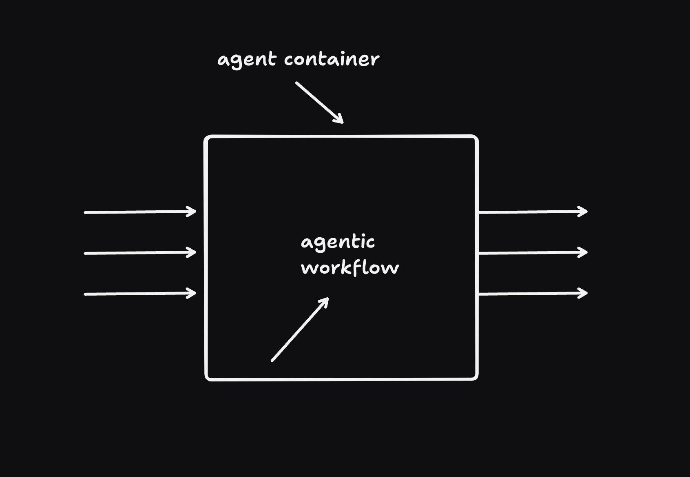

(thanks to ashley peacock ([github](https://github.com/apeacock1991)/[twitter](https://x.com/_ashleypeacock)) for inspiring me to write this. he built [an ai agent to manage customer service simultaneously with email/chat](https://x.com/_ashleypeacock/status/1886855862670782552) that got me thinking about this. follow him, [buy his book](https://pragprog.com/titles/apapps/serverless-apps-on-cloudflare/))

we've already touched around this in different ways with [full stack ai agents](/posts/full-stack-ai-agents), the ability to [assign tasks](https://sunilpai.dev/posts/ai-agents-need-tracking/), which all imply that ai agents should be addressable in some way; some way to "talk to them", identify them. concretely, this means that an ai agent should have a URL, and an email address (and a phone number?), maybe more.

building agents on durable objects already mean they're addressable inside a Worker with a DO namespace + id, but we can go further and make them addressable from the outside. let's generalize ashley's example. we make a helper function that wraps the root worker to intercept http requests/websockets, and email. If a new email comes in to help@domain.com, we route it to a new agent. you can also email the agent directly. you can also visit /agents/:id to interact with the agent with a chat interface. inside the agent, we can tell whether a user is currently connected to a websocket or not(via the ui), and we use that to decided whether to respond via UI or via email. (tell me, what else could we do with this?)

```ts
class Agent extends Server<Env> {
  constructor(ctx, env) {
    super(ctx, env);
    // let's setup a table to store messages
    // wherever they come from
    this.ctx.storage.sql.exec(`CREATE TABLE IF NOT EXISTS messages (
    id INTEGER PRIMARY KEY AUTOINCREMENT,
    data TEXT,
    source TEXT CHECK(source IN ('email', 'http', 'websocket')),
    created_at DATETIME DEFAULT CURRENT_TIMESTAMP)`);
  }
  step(data: string, source: string): string {
    this.ctx.blockConcurrencyWhile(async () => {
      this.ctx.storage.sql.exec(`INSERT INTO logs (data, source) VALUES (?, ?)`, data, source);
      // run an LLM step to reply
      return "this would be a reply based on everything in logs";
    });
  }

  onMessage(connection, message) {
    const reply = this.step(message, "websocket");
    connection.send(reply);
  }
  onEmail(email: Email) {
    const reply = this.step(email.body, "email");
    email.reply(reply);
  }

  onRequest(request: Request) {
    const reply = this.step(request.body, "http");
    return new Response(reply);
  }
}
type Env = {
  agents: DurableObjectNamespace<Agent>;
};

function routeAgents<Env>(handler: ExportedHandler<Env>): ExportedHandler<Env> {
  return {
    async fetch(request, env, ctx) {
      const { pathname } = new URL(request.url);
      let match;
      if (/\/agents\/[a-zA-Z0-9_-]+/.test(pathname)) {
        match = pathname.match(/\/agents\/([a-zA-Z0-9_-]+)/);
        if (match) {
          const agentId = match[1];
          const agent = env.agents.get(agentId);
          // forward websockets and requests to the agent
          return await agent.fetch(request);
        }
      }
    },
    email: async (email, env, ctx) => {
      let agentId: string;
      let match;
      if (email.to === "hello@domain.com") {
        agentId = `agent-${Math.random().toString(36).substring(2, 15)}`;
      } else if (email.to.match(/^agent\//)) {
        match = email.to.match(/^agent\-([a-zA-Z0-9_-]+)/);
        if (match) {
          agentId = match[1];
        } else {
          // route to default
          agentId = "default";
        }
      }
      // route emails to the agent
      const agent = env.agents.get(agentId);
      return await agent.onEmail(email);
    },
    queue(batch: messages) {
      // ...
    },
  };
}

// now we can do this:

export default routeAgents({
  fetch: async (request, env, ctx) => {
    // any requests that reach here aren't for agents
    return new Response("hello from the root worker");
  },
});
```

the code is quite straightforward since we have a single thread for a durable object. I would use partysync to simplify websockets and ui boilerplate, of course. (should probably also get an email helper like the above into the partyserver family of libraries soon.)

with this code, we now have a way to route emails to agents, and a way to route websocket connections to agents. we can also visit /agents/:id to interact with the agent with a chat interface (impkemetning left as homework to the reader).

not a groundbreaking idea, but certainly a useful one. it also starts giving shape to another idea, which is that "agents" might not actually have much to do with LLMs after all, they're just containers for execution, that you stuff with capabilities, observability, and a rube goldberg machine that does things. feels like a good mental model to keep in mind.


