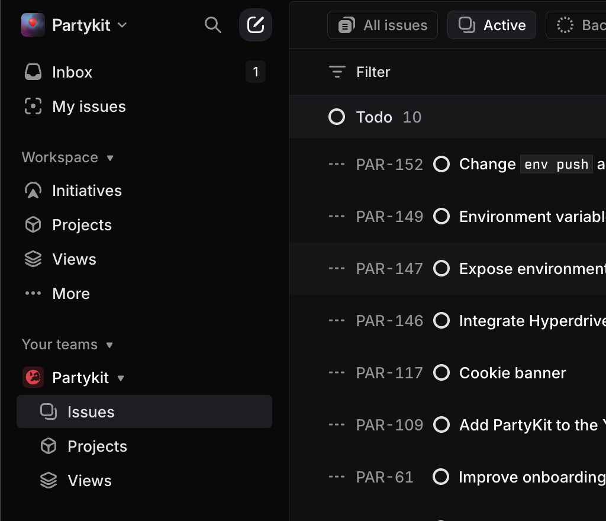

(tl;dr premise: ai agents do tasks. therefore ai agents need a task tracking system. this is probably what a "framework" for ai agents should be.)

think of it as the same vibe you get from tools like jira or linear, but tailored to a bunch of bots that can actually do the work. the real magic is in how it bundles transparency, collaboration, and continuous learning all in one place. first off, you get to see exactly which agent is doing what and why, because every action is logged like a paper trail—no more guesswork about hidden processes. second, you can shift tasks around super easily if an agent gets stuck or if you need a human to intervene, so you don’t lose momentum when you hit an unexpected snag. third, the system creates a sort of knowledge library by storing completed tasks, meaning agents (and humans) can reference past solutions, drastically reducing repetitive labor or duplicating efforts. finally, you can keep an eye on budget constraints like token usage or gpu hours, scaling up or paring down your workforce of agents as needed without ripping your hair out over resource management. so basically, it’s a synergy of human-like pm rigor and ai autonomy, solving a ton of headaches in one tidy package. let's dig in:

## why do we even need this rn?

- in normal human pm setups, you chop a project into tasks.
- each task has a success criteria, you track it, then mark it done.
- we can do the same for ai bc it's basically just automating that same flow.

## core pieces of the puzzle

1. **supervisor agent**

- basically the "pm agent" that divides the big objective into smaller tasks, manages them, and keeps an eye on deadlines or goals.

2. **specialized agents**

- each agent is good at some niche, so you throw tasks at them that match their skillset. they log all their steps so we can see what's going on.

3. **task repo**

- every completed task gets stored here, with logs and everything. if there's a future problem that looks similar, guess what? we can rummage through old tasks to see how we solved it.

4. **budget & resources**

- if you only have a small budget of tokens, you keep it lean. if you have a big bucket of cpu/gpu time, spin up more agents or let them do deeper research.

## step-by-step flow

### step 1: define the big idea

someone (maybe a human, maybe an agent) says, "hey, i want to create a new project." they specify the end goal.

### step 2: break it down

the supervisor agent slices the project into sub-tasks. each sub-task has:

- a description
- success criteria
- dependencies

Main Project Goal (e.g., Build a Website)
↓
Sub Task 1
↓
Sub Task 2
↓
Sub Task 3

### step 3: assign tasks

the supervisor agent delegates tasks to whichever specialized agent can handle them (or to a human if needed). tasks get queued by priority or dependencies.

### step 4: do the thing

agents tackle the tasks. each action—function calls, data lookups, etc.—goes into the log. if an agent can’t finish bc it hits some skill/capacity wall, it reassigns or flags it for a human. (this also gives a convenient ui for "human in the loop")

### step 5: wrap it up

once the success criteria are met, that sub-task is considered done. if a human isn’t happy with the result, they can reopen the task with notes. rinse and repeat.

### step 6: knowledge stash

closed tasks live in a repository. new tasks can rummage through old solutions. honestly, that’s half the point—less re-inventing the wheel each time.

## budgeting & resource usage

- define how many tokens or how much cpu/gpu you can burn.
- if you’re flush, spin up a ton of agents for deeper exploration.
- if you’re broke, keep it minimal and run tasks in a more straightforward manner.

## observability & logs

some folks think monitoring means cpu usage or memory usage. here, we shift to a **task-centric** vantage:

1. you see real sub-task status updates instead of random system metrics.
2. you can do classic burn-down charts to see how many tasks are left.
3. everything’s logged for accountability (or just for debugging).

## final thoughts

this approach merges normal pm logic with ai autonomy. you can keep a handle on progress, plus you get that sweet knowledge repo from past tasks. if you ever want to scale up or pivot fast, you have an infrastructure that’s basically standard pm but for bots.

anyway, that’s the pitch.
