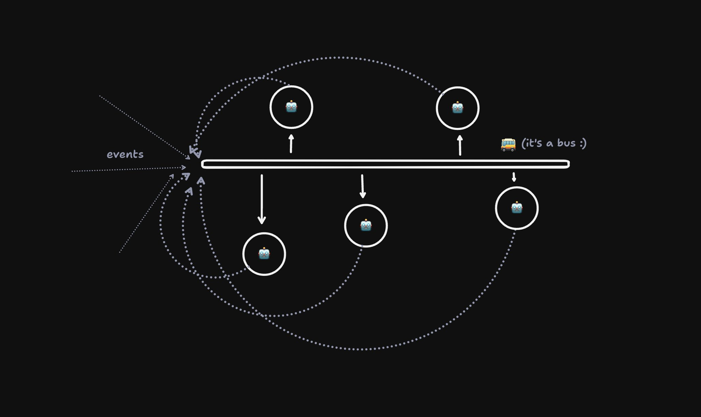

- agents can expose http/ws hooks, email hooks, or arbitrary function calls
- agents can be triggered by http/ws, email, or... (?)

every automation system has some form of an "event bus", whether explicit/implicit. it lets us use vocabulary like "when a new user signs up, send them an email". the naive way of implementing this is to add the email sending logic in the http handler where a user signs up. but the professional way is to push an event on to a queue, and to have a something (usually a workflow) consume that queue event and send that email. this gives us retries, decoupling, all the good things queues give you. you might see where I'm going with this:

```ts
class MyAgent extends Agent {
  onUserSignup() {
    // ... let the robot brain decide what to do next
  }
}

export default {
  async queue() {
    for (const message of batch.messages) {
      if (message.type === "user.signup") {
        (await getAgentByName(env.MyAgent, message.email)).onUserSignup(message);
      }
    }
  },
};
```



so instead of passing the event explicitly/deterministically on to a workflow, let an agent intercept it and "decide" what to do next. is the user currently connected to the agent chat? then ping them right there. maybe schedule some action to happen later (in 7 days, send an email if they haven't made a project yet). etc etc.

standard automation queues might be too noisy here (though probably worth a first implementation) but I suspect there will be a subset of (enriched) events that get passed on to another queue only for consumption by agents.

and of course, the agents could push events back on to the bus...
