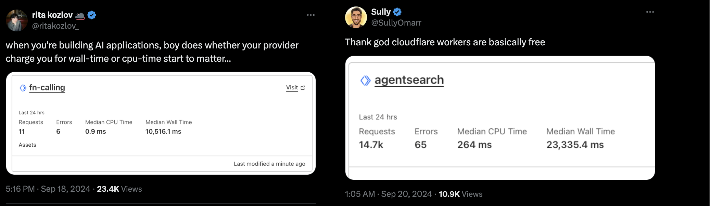

- [**Durable Objects**](https://developers.cloudflare.com/durable-objects/). They're the big thing. You'll get 95% of the wins from just using them well for your ai agent things. You might have read my posts on how [they're just computers](https://sunilpai.dev/posts/durable-objects-are-computers/), [how the future of serverless is stateful](https://sunilpai.dev/posts/the-future-of-serverless/), or my experiments in [building schedulers](https://www.npmjs.com/package/durable-scheduler) and [personal assistants](https://bsky.app/profile/threepointone.bsky.social/post/3lcv7h27ddc2z) with Durable Objects.

  - A "computer" is a great primitive for running code (well, duh). In javascript land, the complete domination of "serverless" models means that developers aren't familiar with getting some code to run _and then keep it running even if you close your browser tab_. "Workflow" services alleviate some of this, but are yet another abstraction over something the Erlang folks knew years before the rest of us. With a Durable Object (which is actually an Erlang style actor, but implemented at the infrastructure layer), you write some code that defines how the "computer" behaves whenever functions are called on it, and it... does the thing. You can write more functions that interact with it, and it'll keep running. You can write functions that peer into it and see what it's doing. You can use plain functions, or you can send it http requests. You can connect to it with a websocket. (In fact, you can connect to a single one with MANY websockets, all from different people). And it'll keep running.
  - This is a big deal for AI agents because they're **THINGS THAT KEEP RUNNING AND DOING STUFF**. You start them off with a job that might take a lot of time ("yo agent, go research the top 50 companies in US healthcare, find out their entire Board members' names and addresses, find out about their lives and background, and then using that, write them sternly worded emails about doing their job better for the people's sake"). You can start it off, and then go do other things. Turn off your laptop, go to bed, whatever. The agent keeps running, and doing stuff. When it's done, it can email you back, or drop you a chat message, or even make a phone call to you (you freakin' millennial elder). Not one kubernetes pod was spun up anywhere. The DO spins up close to you (20ms round trip for me in London). You can have millions of these, spread across the world. The DO spins down when it's not being used, and spins back up with that world famous zero startup time when it is. Each of these DOs [comes with a proper database](https://blog.cloudflare.com/sqlite-in-durable-objects/). You can set alarms to run code at some point in the future ("yo agent, remind me to call my mom in 10 minutes"). Like, waaay in the future ("yo agent, remind me to call your mom in 100 years"). Or many times in a row ("yo agent, check on the pricing of Luigi's mansion on ebay every morning at 8am and buy it if it's below 6$. Stop when you've bought 5 copies.")
  - The current solution is to spin up a whole expensive VM for each agent. Slow, expensive, hard to maintain, overkill. Just use a DO. When you have to run CPU heavy code (encode a video with ffmpeg or whatever), THEN use a VM. Call it from your DO\! [(We might even have something for that soon.)](https://blog.cloudflare.com/container-platform-preview/)
  - Are you getting it? Durable Objects. That's the thing.

- **CPU based billing** for long API calls with a lot of dead air.

  - Cloudflare Workers are billed by the CPU time used. If you have a long API call, and you're just waiting for something to happen, Cloudflare bills you only for the time you're actually using the CPU when the response comes back in. So when you have a call to an LLM that takes 10 seconds to start responding, and then responds in 0.1 second, you're only billed for 0.1 seconds of CPU time. This is a HUGE win for AI driven services. Even if you have a streaming response, you're only billed for the little bits of CPU time when the chunks come in. Check out [this tweet](https://twitter.com/ritakozlov_/status/1836439073327616114) and [this tweet](https://twitter.com/SullyOmarr/status/1836919489188835770).

  

  - Speaking of which...

- [**Workers AI**](https://developers.cloudflare.com/workers-ai/) has dope models for your use. No API keys when used inside Workers.

  - Cloudflare Workers AI is a portfolio of LLMs running on the edge, on GPUs close to your users. So they're fast and cheap. (I'm particularly interested in [Llama 3.3 70b Instruct FP8 Fast](https://developers.cloudflare.com/workers-ai/models/llama-3.3-70b-instruct-fp8-fast/)). Tons more [here](https://developers.cloudflare.com/workers-ai/models/). But of course, you can bring your own models and...

- Send all your AI model calls through the [**AI gateway**](https://developers.cloudflare.com/ai-gateway/).

  - The AI gateway is an LLM specific layer to all your AI model calls, supporting most (probably all?) of your favorite models and 3p services. And out of the box, it gives you caching, observability, rate limiting, retries, fallbacks, all that good stuff. You'll need this anyway, add it with one line of code and you're done.

- You need to store/retrieve data.

  - Other than the database inside every durable object, Cloudflare comes with a whole bunch of storage options. [**KV**](https://developers.cloudflare.com/kv/) for key-value storage, [**R2**](https://developers.cloudflare.com/r2/) for object (i.e, "big files") storage (with zero charges for egress\!), [**D1**](https://developers.cloudflare.com/d1/) for SQL databases, [programmable **caches**](https://developers.cloudflare.com/cache/) on the CDN (literally a cache that you can write code to read/update), and more.
  - The interesting one for agents is [**Vectorize**](https://developers.cloudflare.com/vectorize/), a so-called "vector database"/ tldr \- it helps you store "facts", that you can then query with natural language. This turns out to be immensely useful when building AI agents. [RAG](https://developers.cloudflare.com/reference-architecture/diagrams/ai/ai-rag/) is part of the story here, but there's an opportunity to use it to continuously build a context of the user who's using your agent, and then use that context to make better decisions. (e.g: "yo agent, buy me tickets to new york" and it knows that your prefer aisle seats from the last time you bought tickets)
  - It's cheap, local to your users, and you can use it to build your own semantic search systems.

- You need to run a **Browser**.

  - Cloudflare Workers [comes with an api to run a browser](https://developers.cloudflare.com/browser-rendering/). It means you can run a browser, and then use the results of that browser run in your code. Use it to browse the web, scrape data, push buttons, login as yourself and do stuff. All automated in the background. Built into the platform.

- Loooooads more
  - Wanna do human-in-the-loop? Use an [**Email worker**](https://developers.cloudflare.com/email-routing/email-workers/) and have a full conversation with an unsuspecting claims adjuster. Need to do audio/video with an agent in a call? Haaaave you met [**Cloudflare Calls**](https://developers.cloudflare.com/calls/)? Do you want to host a platform for your users to upload and run their own agents? [**Workers for Platforms**](https://developers.cloudflare.com/cloudflare-for-platforms/workers-for-platforms/) is your jam. Etc etc etc.

Anyway that's why I'm using Cloudflare Workers for my AI agent stuff. Race you to the finish line.
