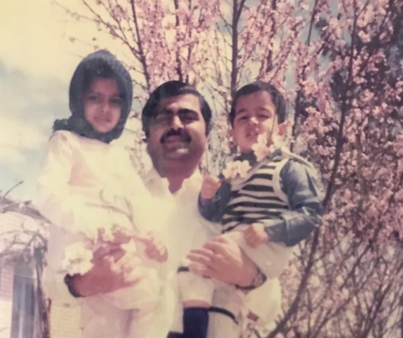

if you know me in person, you know that one of the bits I like to do is, whenever I do something nice for someone, I’ll say, “oh, it’s because I’m collecting favours. I like having people owe me”, usually with a wicked smile and a very poor godfather impression ("one of these days..."). it’s a good joke because it makes people comfortable. if I do something nice for you and then make this obviously ridiculous claim that someday I’m going to cash it in, you don’t have to sit there feeling like you owe me something. we can just laugh about it.

been thinking about where that actually comes from.

my dad’s a doctor in Manipal, my hometown. it’s maybe 50,000 people, something like that. he’s not a specialist or anything. he had his own clinic for many years, and he basically became the family doctor guy in town. the thing I remember about him is that he just said yes to everyone.

people would call him at three in the morning saying they had chest pain, and there was no, “okay, can you call me tomorrow,” or “you should probably go to the hospital,” or whatever. he would just get up, get in the car, go see them, take them to the hospital if he needed to. he knew everyone there, so he’d call somebody, wake up the right doctor, get them admitted, whatever needed to happen. and remember, these people are scared, right? sometimes they’re rude, sometimes they’re incoherent, they’re calling a doctor at three in the morning because something is going badly wrong in their life.

and it didn’t really matter, because his instinct was always basically: okay, solve the problem first. get them to the hospital, get them to the right doctor, make sure they’re okay. you can figure out everything else later. you don’t start with, “well, what is this going to cost,” or, “why didn’t you call earlier,” or any of that stuff. those are all second-order problems. deal with the thing that matters first.

growing up, what I noticed was that everyone in town knew him. people would meet me and they’d be like, “oh, you’re the doctor’s son,” and then they’d tell me some story about how he’d helped them, or their mother, or their uncle, whatever. and look, I’m not saying we were poor. we weren’t. but we also weren’t especially wealthy or anything, and still, I had this incredibly comfortable childhood.

we’d go to a restaurant and somehow we’d get a nice table. we’d order takeaway and they’d look after us ("doctor, I kept aside the good crab for you"). when I went to rent videotapes, because I was just fucking devouring movies as a kid, the guy would keep the good movies aside for me. I’d go to the library and they’d keep aside the Asimovs because they knew I’d want them. I didn’t understand any of this as a kid. I just thought that was what life was like.

many, many years later, I realised I basically copied my dad. not the doctor bit, obviously, but this particular instinct of how you deal with people when they come to you with a problem.

because the thing is, if somebody is asking you for help, they're usually not having their best day. something is broken, something has gone wrong. in technology it might be, “hey, my account is down,” or “are you guys having downtime?” or “this code doesn’t work,” or “can you please help me with this thing,” right? and sometimes they’ll come in hot. they’ll be annoyed, they might be a little rude, they might not phrase the thing perfectly.

I think one of the mistakes people make is they immediately start policing the interaction, like, “well, if you want my help, you could at least ask nicely.” bro, the reason they’re talking to you is because something is fucked. you shouldn’t make people earn your help by being perfectly polite while they’re having a bad time.

this is something, by the way, that I think people in hospitality are incredibly good at. I’ve noticed over the years that I’ve picked up a bunch of mannerisms from people who work in restaurants and hotels and things like that. someone comes to you with a shitty attitude and you don’t immediately mirror it back at them. you smile, you get on their side, you’re like, “yeah, man, that sounds shitty. let me see what I can do.” and it’s amazing how quickly that disarms somebody, because suddenly you’re not another obstacle they have to fight. you’re on the same side.

I think I’ve approached technology this way for a long time. twitter too, actually. friendships. work. a lot of things. and the funny thing is that all this goodwill compounds in completely ridiculous ways.

which is where the joke about collecting favours gets funny again, because I don’t actually keep track of any of this shit. I couldn’t tell you who owes me a favour. that would be insane. you just help people, and then ten years later something happens and all these relationships that you didn’t even realise you were building suddenly become visible.

there are two examples I think about a lot. in 2021, when the Delta wave of COVID was going through India, it was fucking horrible. people were dying everywhere, and I was sitting in the UK, where we had already started talking about summer plans because vaccines were arriving, and I had this enormous amount of survivor’s guilt.

so I was like, okay, I should do something. I figured I’d do a little fundraiser where if you donated $100 to one of the relief efforts in India, I’d give you half an hour of my time. I thought, you know, maybe I’ll raise $2,000, $3,000, something useful.

I ended up doing it for two weeks and raising about $56,000, and man, I cried so much, because it felt like fifteen years of my life suddenly came out of the woodwork. people I hadn’t spoken to in years. old friends. people I’d helped with some random thing once. people I barely remembered interacting with.

I’d get a DM from somebody with a receipt for $5,000 and they’d just say, “hey, don’t need your time. appreciate what you’re doing. miss you. hope you’re well.” and I remember thinking, holy shit. I thought I had raised $56,000 in two weeks, but obviously I hadn’t. in some weird sense it had taken fifteen years.

then something similar happened more recently where a relatively famous person in tech tried to cancel my ass on twitter over something they thought I’d done. and I was scared, man, like genuinely scared, because when somebody with a massive audience says something about you publicly, you don’t really know where that goes. I've spent all this time building a career and reputation and it was looking to go down the toilet in hours. 

but over the next day or two, half the internet just showed up to support me. people were basically saying, “this doesn’t sound like Sunil. talk to him.” people who had known me for years, people who had interacted with me once or twice, whatever. and again, it was this strange experience of watching something that had been invisible suddenly become visible.

which is reputation, right? and I don’t mean personal brand. god, I hate that phrase. I mean reputation in the old-fashioned sense. what do people say about you when you’re not in the room? when something ambiguous happens, what intention do they assign to you? do they think, “that guy is probably trying to fuck somebody over,” or do they think, “hang on, that doesn’t sound like him.” do they take your call? do they recommend you for something? do they introduce you to somebody? if you’re having a terrible time, do they show up?

and this is the bit I’ve been thinking about recently, because I see people falling into a really nasty trap, especially on twitter. twitter gives you extremely fast feedback. you say something a little edgy, something a little mean, maybe you think you’re being funny, maybe you think you’re punching up, whatever, and if it works, you know immediately. likes, retweets, followers, replies, numbers go up, and then of course your brain goes, ah, okay. more of that.

but there’s another set of numbers that you don’t get to see. you don’t get a notification that says, “three people respected you slightly less after reading that.” you don’t get one saying, “someone who was thinking about introducing you to somebody decided not to,” or “someone who thought you might be great to work with now thinks you seem like kind of a pain in the ass.” that stuff is completely invisible.

and the really dangerous thing is people usually won’t tell you. they’ll still be nice to you. they’ll still reply to your tweets. if you’re famous or powerful or useful enough, they might be extremely nice to you. they just stop inviting you to things, stop recommending you, stop sticking their neck out for you, stop giving you the benefit of the doubt.

so you can actually get more popular while quietly losing people’s respect, and you have absolutely no dashboard for it.

I think if you do this for long enough, there’s a really sinister cycle there. you become a little more abrasive or transactional because that gets rewarded, then people become a little less generous with you, but you don’t know why because nobody tells you. eventually you look around and you’re like, “see? everyone is selfish. everyone is transactional. nobody does anything for anybody unless there’s something in it for them.”

and then you behave even more transactionally because you think that’s how the world works.

but, like, maybe you helped make your world that way.

anyway, I don’t think the lesson here is that you should let people walk all over you. that’s not what my dad did either. you can have boundaries. you can tell people to fuck off when they deserve it. obviously.

it’s much simpler than that: someone comes to you with a problem, just help them with the problem first. figure out the rest later.