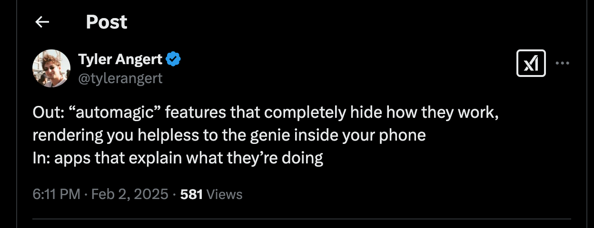
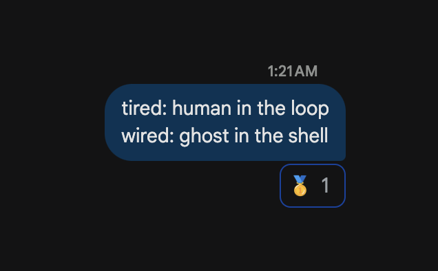
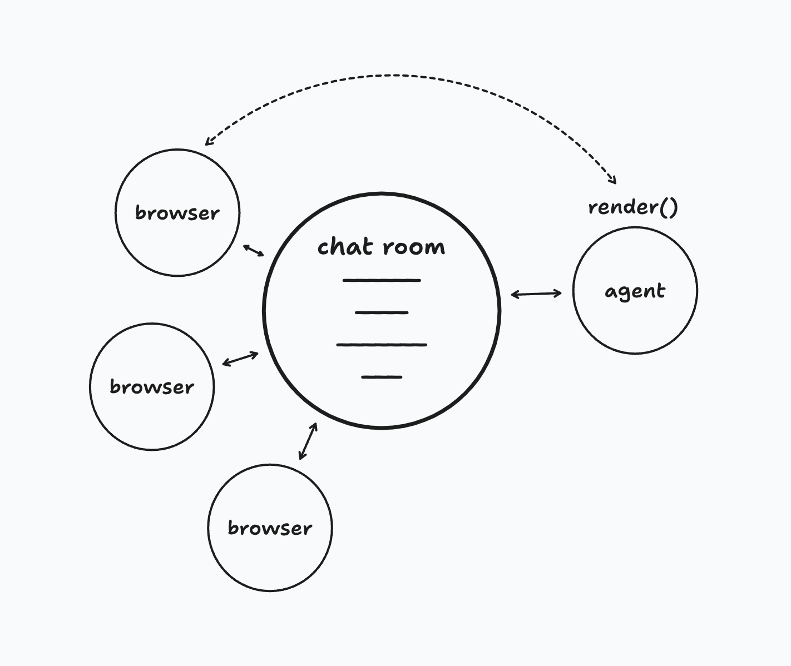
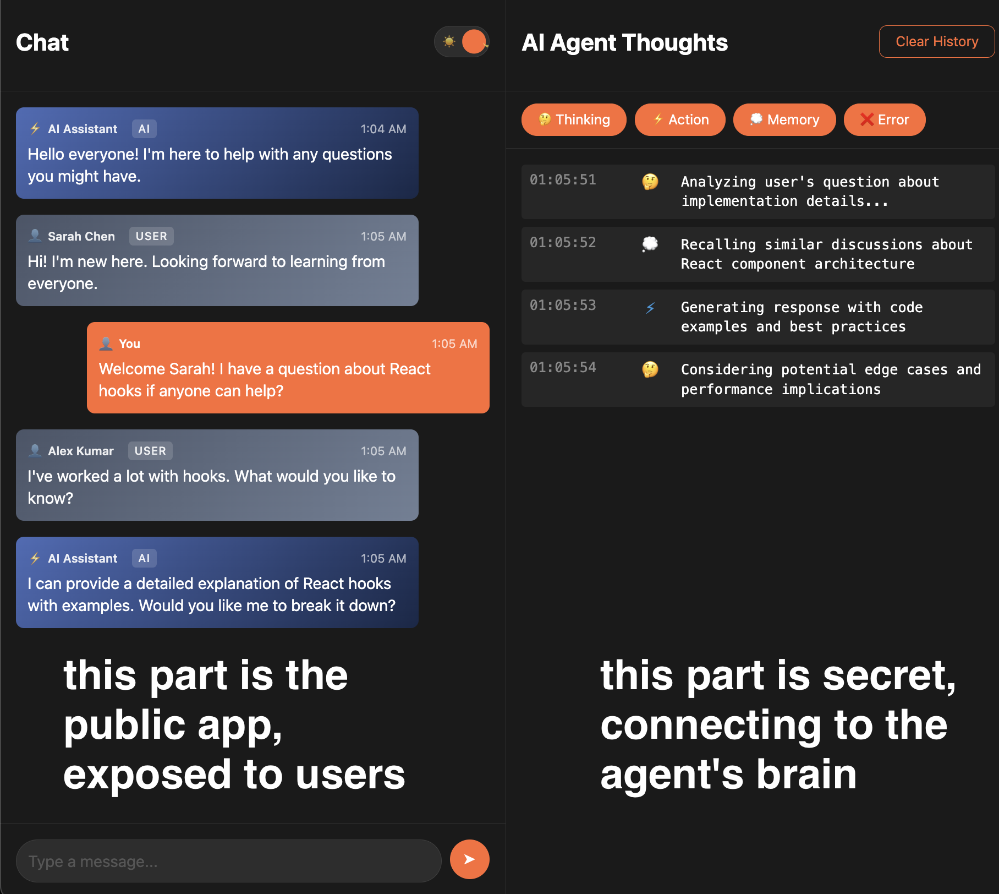

what if you gained root access into an agent's brain? what would it look like?


ai agents are little long running processes that are "doing stuff" in the background. business processes, personal automation, chatbots, workflows, etc. durable objects are a fantastic fit as containers for these agents. (here's a video where I talk about running the anthropic agent patterns inside durable objects https://x.com/threepointone/status/1884783568603246802, longform post coming soon). now sure, we can build an application ui for the experience. but... how do we look _inside_ what the agent is doing? we could log metrics and events, and stream them somewhere, but this thing is a living-ish thing. like any other workflow/automation, we sure would like to to be able peer INSIDE these agents to see what's happening.

i.e., not only do agents have input/output/state, they also should have a ui! call it root, an admin panel, a dashboard, whatever. conceptually, every Agent should have a `render()` method that lets your root around its innards, see what's happening, and even modify the agent's state.

(right?! right?!)



Here's an example; let's say we have a (multiplayer) chat interface. We have a durable object `ChatRoom` for each chat session, that clients connect to. A simple method of adding "ai" to this chat would be to add a handler inside this chat durable object that responds to every message with an ai generated response (indeed, that's what the official template recommends, and it works well.) for the sake of this example, tho, let's make it a bit more interesting. we'll make an `Agent` that connects to the chat, that can see and respond to the messages, but also has its own ai-specific `render()` method.

```tsx
// pseudo code

class ChatRoom extends DurableObject {
  onMessage(message: string) {
    this.broadcast(message); // this will send the message to all connected clients
  }

  render() {
    return (
      <div>
        <h1>Chat Room</h1>
        <Chat />
      </div>
    );
  }
}

class Agent extends DurableObject {
  constructor() {
    // connect to the chat room
    this.connect(Room.get("some-room-name"), {
      onMessage: (message: string) => {
        // do something with the message
        // like reply, analyze, do tool calls, etc
      },
    });
  }

  render() {
    if (!this.isAdmin()) return null;
    return (
      <div>
        <h1>Chat Agent control panel</h1>
        {/* a bunch of buttons to do stuff inside the agent */}
        <Actions />
        {/* a log of everything that's happened inside the agent */}
        <Logs />
      </div>
    );
  }
}
```

We then setup urls so that everything on `/chat/:id` will be handled by the `ChatRoom` durable object, rendering a chat ui as expected. but we'd also like to have a `/agent/:id` url, that will be handled by the `Agent` durable object. (You'd probably also setup some auth so that only admin users can access the agent. whatever works for you, a discussion for later.)



"hidden" from the rest of the app, the agent now has its own state/persistence, and we can implement functionality that's unique to it. in this example, let's use a reasoning model to generate a response. we'll hide the actual "reasoning" output from the chat room, and only send the final response. further, we can now add a ui to the agent, and have it render itself. we'll implement this agent with partysync as well, so that a browser can connect to it and see the agent's state/ui.



with this setup, every agent now becomes a proper server, a full stack web app, with its own ui. there's nothing stopping us from building fully interactive apps that could modify the agent, send it input/output, etc. a whole new world opens up. you could "login" to an agent, and temporarily give it a new persona, or even a new model. maybe share credit card details while it's trying to make a transaction, and then delete the data to make it "forget" it. change it's prompt midway. perhaps even give it a new model.

Now, let's talk about how we can build this. First, a sidequest about some recent developments that make this possible.

[vite](https://vite.dev/) is a dev/build tool that is super popular in the javascript ecosystem. it started out as a tool for building plain frontend apps, but now works for server side code, etc. it's pretty great. it's particularly nice when building both frontend and backend together, in the same project (so called "full stack apps").

of note, everyone loves the developer experience of `vite dev` - it's really fast, there's an amzing ecosystem of plugins, which you can mix and match for your own stack. some folks might know I've [been vite-pilled for a while now](https://sunilpai.dev/posts/esbuild-with-jason/) (we were so young...), so I'm not even parroting the narrative; I _set_ the damn narrative you common folks consume. I would never shill a product simply because I'm employed by them, or have any financial incentive to make people use it.

ahem. anyway.

cloudflare workers is the world's best platform for running your javascript. the key thing is a custom javscript runtime [workerd](https://github.com/cloudflare/workerd) (built on v8) that is optimized for serverless environments; which gives it magic powers like zero start up time (and it's [super clever how that works](https://blog.cloudflare.com/eliminating-cold-starts-with-cloudflare-workers/)), running on a planetary netowkr in hundreds of cities and thousands of points of presence. this custom runtime has unique apis (that are inspired by standards) that make it a joy to work with; in addition to stuff like `fetch`, `Request`, `Response`, `WebSocket`, `caches`, etc, it has [durable objects](https://developers.cloudflare.com/durable-objects/what-are-durable-objects/), which is the actor model, but for javascript. (I have written about durable objects before: [1](https://sunilpai.dev/posts/the-future-of-serverless/), [2](https://sunilpai.dev/posts/spatial-compute/), [3](https://sunilpai.dev/posts/durable-objects-are-computers/))

the local dev experience is powered by [wrangler](https://github.com/cloudflare/wrangler), which is a cli tool for working with cloudflare workers. among other things, it handles all the boring stuff like compiling your code and dependencies, and running it inside workerd.

`vite dev` is vite's story for local development. it handles all the boring stuff like compiling your code and dependencies... but then for server side code, it uses node. DAMMIT. sure, node now supports standards APIs like `fetch`, `Request`, `Response`, etc, but I can't run workerd-specific stuff durable objects in it. there are workarounds, but they're not ideal. you'd have to build your frontend application with vite dev, and run wrangler in parallel for the backend, it was all very fidgety and not satisfying.

vite 6 fixes that specific problem. tl;dr - [with the new environment api](https://vite.dev/blog/announcing-vite6#experimental-environment-api), you can now run your code inside _any_ custom runtime.

peeps inside cloudflare have been furiously working then on making `vite dev` work with workers. to have a great integrated experience when building an app that targets browser sand workers (and maybe even others? like node, react-native, deno, etc) at the same time. [they just started shipping 0.0.x versions of the plugin](https://npmjs.com/package/@cloudflare/vite-plugin), which means it's time to start playing with it!

(the big caveat here is that existing frameworks still have to change code to support this. that's a process that's underway, but it's only a matter of time before it's done.)

building this without as two separate apps would've been a complete fucking pain in the ass. it would've been doable, but the amount of back and forth and operational complexity... just thinking about it would've been a nightmare. but now I can build this whole app as a single concept, with great dx to just ship when I'm done.

so... that's the thing. full stack ai agents. does your ai agent have a ui, anon?
