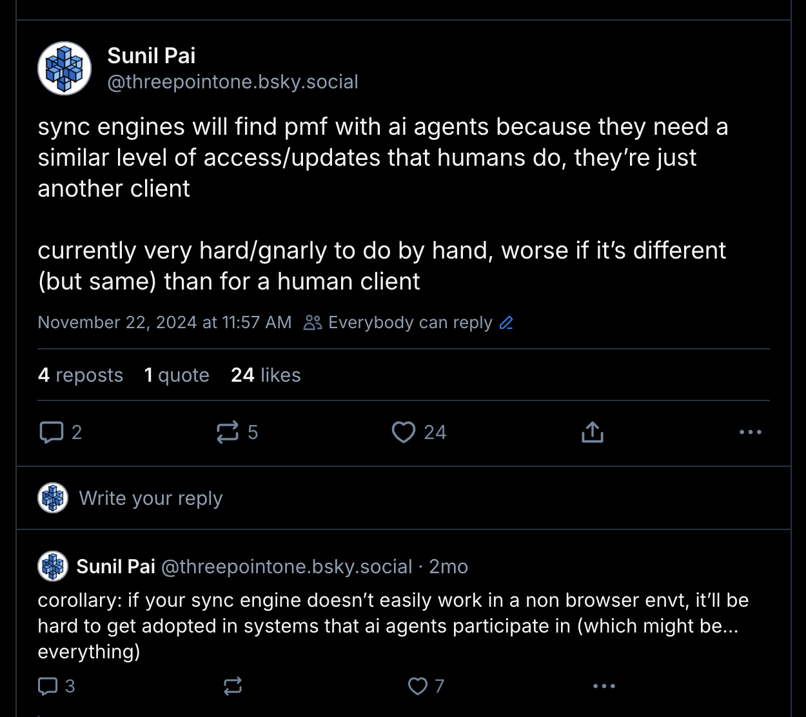
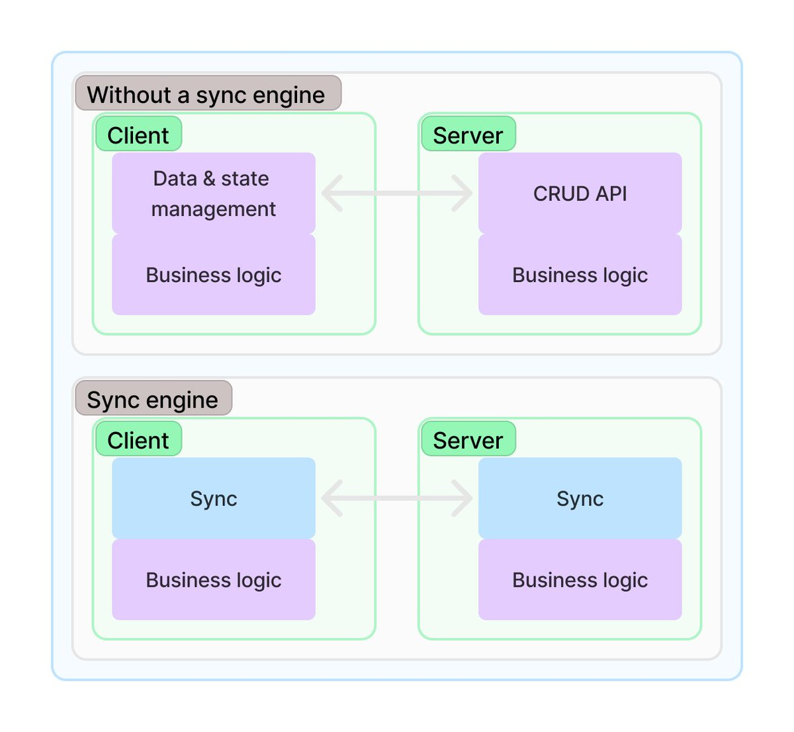

(did sunil really make a title with TWO hyped up topics? yes he did.)

first, the punchline.



let's start with a mental model of how you would build an app. conceptually, it's a machine with configuration, state, and "methods"/ functions that you can call on them with arguments to affect change. we might represent it in code like this:

```ts
// let's say we're building a todo app
const app = {
  config: {
    darkMode: false,
    language: "en",
  },
  state: {
    todos: [],
    input: "",
  },
  methods: {
    toggleDarkMode: () => {
      app.config.darkMode = !app.config.darkMode;
    },
    addTodo: (todo: string) => {
      app.state.todos.push({
        id: crypto.randomUUID(),
        title: todo,
        completed: false,
      });
      app.state.input = "";
    },
    removeTodo: (index: number) => {
      app.state.todos.splice(index, 1);
    },
    // ...
  },
};
```

with a machine like this, we can build a ui for the todo app. it might look like this in react:

```tsx
function TodoApp() {
  return (
    <div>
      <input value={app.state.input} onChange={(e) => app.methods.setInput(e.target.value)} />
      <button onClick={() => app.methods.addTodo(app.state.input)}>Add Todo</button>
      {app.state.todos.map((todo) => (
        <div key={todo.id}>
          <input
            type="checkbox"
            checked={todo.completed}
            onChange={() => app.methods.toggleTodo(todo.id)}
          />
          <span>{todo.title}</span>
          <button onClick={() => app.methods.removeTodo(todo.id)}>Remove</button>
        </div>
      ))}
      <button onClick={() => app.methods.toggleDarkMode()}>
        {app.config.darkMode ? "Light Mode" : "Dark Mode"}
      </button>
    </div>
  );
}
```

nice. now of course, this has to actually persist to a server/database somewhere. so we'd do somthing like this in our methods:

```ts
methods: {
  // ...
  saveTodos: async () => {
    await fetch("/api/todos", {
      method: "POST",
      body: JSON.stringify(app.state.todos),
    });
  },
};
```

and we'd await it in our addTodo method:

```ts
addTodo: async (todo: string) => {
  app.state.todos.push({
    id: crypto.randomUUID(),
    title: todo,
    completed: false,
  });
  await app.methods.saveTodos();
};
```

cool. we now have a todo app that persists to a server.

(now the nerds in the audience are probably pissed because this doesn't wire up to a react rerender, and
might show view tearing, and we're not using any state management library, whatever. don't care, this post isn't about those specifics, it's about the mental model. get bent losers.)

in a real app, you'd use a state management library that formalises this relationship between state, ui, and methods. (e.g. redux has "actions" and "reducers" for this that act on a "store" of state, and rerender on every state change.)

on the server side, you'd mirror this structure. it might look like this:

```tsx
const server = {
  state: {
    todos: [],
  },
  methods: {
    getInitialState: async () => {
      const todos = await sql.query("SELECT * FROM todos");
      return { todos };
    },
    addTodo: async (todo: string) => {
      await sql.query("INSERT INTO todos (title) VALUES (?)", todo);
    },
    // ...
  },
};
```

this gives an architecture that gives us "separation of concerns" - the ui acts as "client" and the server acts as a, er, "server". the server only cares about the data and some "business logic", independent of the clients/uis that will be built to interact with them. importantly, the server provides apis to 1. gather context about the system being manipulated, 2. perform actions on the system.

a lot of this is boilerplate, and has led to the rise of "local first" systems in building UIs. these systems usually have a "sync engine" that handles syncing most/state state between the client and ther server, and the client then performs "actions"/"mutators" that 1. optimistically updates the state/ui on the client 2. sends the action to the server where it gets executed (with any other database updates/side effects), and then 3. confirms and commits the action on the client side. it's like git, but for uis. very demure, very mindful. of note, they leverage persistence systems on the browser side (via indexxeddb, or localstorage, or file system apis) to persist state, so they don't have to fetch the entire server side state on restarts etc. particularly great for highly interactive apps.

I recommend going to [this site](https://localfirstweb.dev/) to learn more, see what different flavours exist, and get a sense of the ecosystem. there's also a great post on sync engines by [Adam Nyberg](https://x.com/Adam_Nyberg): https://adamnyberg.se/blog/2025-02-11-real-time-sync-engines/ that includes this neat diagram:



anyway. ai agents. these are processes that act on a "state" and "methods" of a "machine". they connect to data sources and perform actions on the machine. they use the context of the machine to make decisions. and users (us) can interact with them. they benefit from fast startup time, and usually have access to their own internal persistence system to maintain that context over long periods of time.

sounds very similar to a ui/browser/client, right?

in this very nascent period of growth for ai agents, they're being built as stateless systems, just like browser apps were built before sync engines were a thing; workflows initialise and grab a whole bunch of state and context from disparate systems, and explcitly call async apis that affect change, and then discard it all after a "goal" is reached. this isn't ideal, agents are meant to long running processes that can "sleep"/pause and resume, and they're meant to be able to act on long term context.

I contend that ai agents should be built exactly like local first apps/clients. every agent should be able to connect to a "server" that provides the context of the system, sync that state over to it's own persistence system, and perform actions on the system. while this has the immediate benefit of reducing boilerplate while building agents, it also means that the entire system (a browser client app, the mobile app, the ai agents) can be iterated on and deployed without worrying about api drift and inconsistency. and (brace yourself for some shilling) this means that your ai agent infrastructure should probably be stateful (_cough_ durable objects _cough_).

I explored this in the [full stack ai agents](https://sunilpai.dev/posts/full-stack-ai-agents/) post. the ai agent durable object connects to the chat server durable object, and slurps down the state of the chat room, and then uses that to performa analysis on the chat history. this is built on my (wip) sync engine [partysync](https://github.com/threepointone/partyserver/tree/main/packages/partysync) (I should push up the code that syncs across DOs soon.)

so, that's the pitch. if you're building a local first system, I highly encourage you to consider making sure they're "isomorphic" so that they can run in a browser, mobile app, or ai agent. (yes I just added a third hype word to this!) and use a platform that [makes this part easy, so you can focus on the business logic](https://x.com/threepointone/status/1889661957520736622).

find me on twitter and let's talk about this post.
