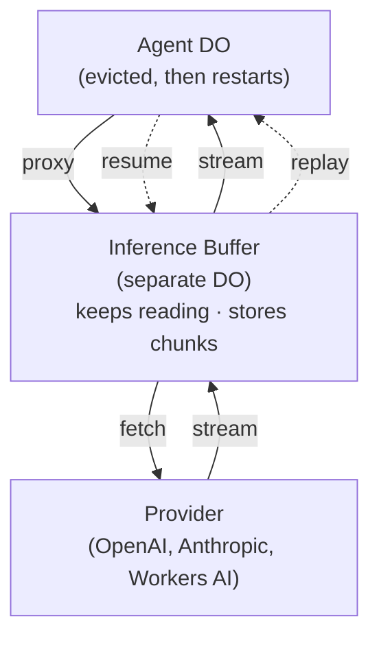

_(this post itself is LLM slop, but it tastes alright)_

tl;dr - put a durable buffer between your agent and the LLM provider. the provider connection now outlives your process, so a deploy in the middle of a stream doesn't cost you the tokens you already paid for. and the same buffer that lets a disconnected browser catch back up is the thing that recovers a crashed turn. one log, two readers.

---

I've spent the last few weeks stuck on one question: what happens to an agent when the process running it dies in the middle of a turn?

it goes deep fast. tool calls that may or may not have fired. sub-agents. half-written streams waiting on a human. I'm writing all of that up separately (durable agent loops, coming soon). but one piece of it is small and self-contained enough to pull out on its own:

**when your process dies mid-inference, you don't just lose your place. you lose money.**

## the problem that's easy to miss

your agent opens a streaming request to a model, and the model starts generating. you're billed for those output tokens the moment they're generated. then your process gets replaced. maybe a deploy, maybe an eviction, maybe an OOM.

the usual reassurance is "don't worry, the state is durable." and sure, your conversation history survived. but the *in-flight HTTP request to the provider* did not. it lived in the memory of the process that just died. so when you recover, your only option is to **make the call again**. you pay for those output tokens a second time.

now make it an agent. a real one does multiple tool calls in a single turn:

```
user message
  → stream some text
  → tool call → tool result
  → stream more text
  → tool call → tool result
  → stream the answer
```

every interruption throws away *all* the output tokens generated so far in that turn. and it scales with the model you actually want to use: output runs $30 per million tokens on `gpt-5.5` versus $2 on `gpt-5.5-mini`, so a flagship retry burns ~15x what a mini one does. the better the model, the more it hurts. deploys happen constantly, evictions happen constantly, and each one that lands on a live stream is money straight out the window.

the happy path hides it. you only see it when you start counting tokens after an incident and the numbers don't add up.

## the move: stop tying the request to the process

the reason a crash wastes tokens is that the provider connection lives *inside the thing that crashed*. so move it out.

put a buffer between the agent and the provider, and make it a **separate deployment**: its own Worker, its own Durable Object.



when a request comes in, the buffer does three things in order. it resets its state for a fresh stream. it kicks off a background task that drains the provider connection into SQLite. and it immediately hands the caller back a stream that tails those same rows as they land:

```ts
async proxyAndBuffer(req: ProviderRequest): Promise<Response> {
  this.resetBuffer();                 // status = "streaming", chunkCount = 0
  const reader = (await fetch(req.url, req)).body!.getReader();

  // drain the provider in the background. deliberately NOT awaited - the
  // response below returns right away while this keeps running.
  this.keepAliveWhile(() => this.consumeProvider(reader));

  // give the caller a stream that tails the rows as they're written.
  return new Response(this.tailFrom(0), {
    headers: { "X-Buffer-Status": "streaming" }
  });
}

private async consumeProvider(reader: Reader) {
  for (let i = 0; ; i++) {
    const { done, value } = await reader.read();
    if (done) break;
    this.sql`INSERT INTO buffer_chunks VALUES (${i}, ${decode(value)})`;
    this.notify();                    // wake any tailers (more below)
  }
  this.setStatus("completed");
}
```

the load-bearing part is what `consumeProvider` is *not* attached to. it doesn't run inside the agent. it runs here, in a separate deployment that wasn't touched by the agent's deploy. so when the agent gets evicted mid-stream and its tail connection is cancelled, the drain loop keeps reading. the tokens you paid for keep landing in SQLite, whether or not anyone's listening.

`keepAliveWhile` is what holds the buffer open while it drains. a long generation has quiet stretches, and a Durable Object can be evicted for looking idle. `keepAliveWhile` heartbeats an alarm for the duration of the drain and drops it the moment the task finishes or throws, so the buffer survives those gaps without leaking a heartbeat afterwards.

when the agent restarts, it calls `/resume?from=N` and gets the chunks it missed. no wasted tokens, no duplicate provider call.

## one log, two readers

while building this I kept feeling like I'd already solved a piece of it before. and I had. it's the same problem as *resumable streaming*. you know the one: a user is mid-response, closes their laptop, switches from wifi to cellular, comes back, and the stream just... continues. the way you do that is you persist every chunk to a durable log as it streams, and on reconnect the client reads stored chunks until it catches up to the live cursor.

recovery is the *exact same log*. the buffer stores each chunk in SQLite keyed by index:

```sql
CREATE TABLE buffer_chunks (
  chunk_index INTEGER PRIMARY KEY,
  data TEXT NOT NULL
)
```

reading it back is one function. the live proxy called `tailFrom(0)`; a resuming agent calls `tailFrom(N)` with the last chunk index it saw. the cursor is the only difference:

```ts
tailFrom(cursor: number): ReadableStream {
  return new ReadableStream({
    pull: async (c) => {
      const rows = this.rowsFrom(cursor);   // everything stored since `cursor`
      if (rows.length) { c.enqueue(rows); cursor += rows.length; return; }
      if (this.isDone()) return c.close();  // completed / interrupted / error
      await this.signal.promise;            // else wait for the next notify()
    }
  });
}
```

so `/resume?from=N` is just `tailFrom(N)`. and there are only two situations it hits:

- **the producer is still alive.** more chunks are coming. it tails: serve what's stored, wait for the next one, repeat, until the stream completes. this is a browser reconnecting.
- **the producer is gone.** it died with the old process, so the stream is *orphaned* and no more chunks are coming. instead of tailing toward a live cursor, you reconstruct whatever's stored, finalize it, and continue the turn from there. this is crash recovery.

same durable log. the *only* difference is whether a live producer is still attached. resumable streaming answers "a client reconnected: catch it up." recovery answers "the producer died: finish what it was writing." persisting chunks for reconnects buys you most of crash recovery for free.

the buffer makes the distinction explicit in its state machine. on restart, if it finds its own status still marked `streaming`, it *knows* the previous incarnation died mid-flight, flips itself to `interrupted`, and callers know they're getting partial data:

```
idle → streaming → completed → (ack / TTL) → idle
            │
            │ [DO evicted]
            ▼
       interrupted   ← "the producer is gone, here's what I have"
```

## tailing without polling

one detail worth keeping. the tail reader never polls SQLite. polling a database in a hot loop to see if a token landed feels fine in a demo and is miserable in production. instead, the drain loop's `notify()` resolves a shared promise after each insert, and the tailer just `await`s it.

it works because a Durable Object runs single-threaded: the insert and the notify happen in one synchronous block, so a tailer that wakes up always sees the new row already committed. no race, no poll interval to tune. the runtime does the hard part for you, which is most of the pitch for building agents on DOs.

## replay without writing a single SSE parser

ok, you've got the run back. now you have to turn it into something your agent loop can continue from. the obvious approach is to parse the buffered SSE yourself. that's a trap. you'd own a bespoke parser for OpenAI's format, and Anthropic's, and Google's, forever, and chase every wire-format change they ship.

so don't. store **raw bytes** and reuse the provider's *own* parser on the way back. that's the model going into `workers-ai-provider`: one provider routes every model through AI Gateway, each plugin carries its native wire format, and resume is on by default.

```ts
import { createWorkersAI } from "workers-ai-provider";
import { openai } from "workers-ai-provider/openai";
import { anthropic } from "workers-ai-provider/anthropic";

const workersai = createWorkersAI({
  binding: env.AI,
  providers: [openai, anthropic]     // each plugin brings its own SSE parser
});

const result = streamText({
  model: workersai("openai/gpt-5.5", { resume: true })
});
// result.response.headers["cf-aig-run-id"] identifies the run to re-attach to.
```

`streamText()` parses, runs the tool loop, handles reasoning, and renders the response natively, the same as a fresh call. zero custom SSE parsing anywhere, and a provider changing their format costs you nothing because you're on *their* parser.

the eviction case is the whole point. as the stream runs you persist `{ runId, eventOffset }` (via `onDispatch` and `onProgress`); when the agent comes back, you re-attach to the same run instead of re-calling the model:

```ts
const stream = createResumableStream({
  binding: env.AI,
  gateway: "my-gateway",
  runId,                             // saved from cf-aig-run-id
  fromEvent: savedOffset,            // saved from onProgress
  onResumeExpired: "accept-partial"  // once the ~5.5 min buffer TTL elapses
});
```

no re-billing, no duplicate call, no parser to maintain.

## wait, does anyone else do this?

I went and checked, because "never waste a token" seemed like something someone would have built already. turns out one provider has built almost exactly this (for their own API), and everyone else leaves it to you.

the two questions that matter:

1. does the provider **keep generating** after your connection drops? (or are the tokens gone?)
2. can you **resume the same stream by cursor**, without re-billing what was already generated?

| | keeps generating after you drop? | resume by cursor, no re-bill? | how |
| --- | --- | --- | --- |
| **OpenAI** (Responses, background mode) | yes | yes | `background: true` + `stream: true`, resume via `?starting_after={sequence_number}` |
| **Anthropic** | no | no | re-prompt the model to "continue" - re-bills tokens, may drift |
| **Google Gemini** | no | no | same continue-from-here re-prompt hack |
| **OpenRouter** | partial (cancel stops billing) | no (whole-response cache only) | response caching + cancellation; build your own buffer |
| **Vercel AI SDK** (`resumable-stream`) | yes (producer kept alive via `waitUntil`) | yes, but page-reload only | app-layer Redis buffer - same trick, narrower scope |
| **this / AI Gateway** | yes | yes | infra-layer durable buffer, provider-agnostic, survives *your deploy* |

a few things jump out.

**OpenAI already proved the idea.** [Background mode](https://developers.openai.com/api/docs/guides/background) on the Responses API keeps the job running server-side even if you drop, and you resume by tracking a `sequence_number` cursor: `GET /v1/responses/{id}?stream=true&starting_after={n}`. this is durable inference, provider-native, shipping today. it's just locked to OpenAI's own API (needs `store: true`, and TTFT runs higher).

**Anthropic and Gemini make you re-pay.** neither supports server-side resume. the documented recovery is to capture the partial response and send a *new* request asking the model to continue from where it left off. that spends the output tokens again, and the continuation isn't guaranteed to match. [Anthropic's docs](https://platform.claude.com/docs/en/build-with-claude/streaming) even note that tool-use and thinking blocks can't be partially recovered. this is exactly the tax from the top of this post.

**Vercel's `resumable-stream` is the closest cousin.** it independently arrived at the same core trick: the producer completes the stream even if the original reader goes away, and a second consumer can follow along. but it's app-layer, so you run the Redis, and the producer lives in *your* process - so it doesn't survive you redeploying your code. that last case is the whole reason I needed a separate deployment.

so it's not that nobody does this. OpenAI showed it's worth doing for one API. everyone else makes you re-prompt and re-pay. and nobody covers the case where *your own process* is the thing that died. that's the gap.

## the punchline: this is coming to AI Gateway

so where should this live? the comparison points right at it. OpenAI's version works because it runs on infra you don't deploy; Vercel's falls short because it doesn't. you want the buffer somewhere that's already in the request path, already fronts every provider, and never gets redeployed when you ship your code. that's AI Gateway.

I prototyped it as a Durable Object ([RFC #1257](https://github.com/cloudflare/agents/issues/1257)), but it was always meant to live in managed infrastructure, not in your agent. put it in the gateway and you take OpenAI's background-mode idea and hand it to *every* provider, including the ones that make you re-pay today.

and the good news: durable resume is **coming soon to Cloudflare AI Gateway**. it's not widely released yet, but I've been running real traffic through it. every run comes back with a `cf-aig-run-id`, and you can ask the gateway to replay from an event index. I ran six models through it, cut each stream at the midpoint, and asked for the tail:

| model | events | bytes | resume from mid → tail matches? |
| --- | --- | --- | --- |
| gpt-4o-mini | 63 | 20,604 | ✅ byte-exact |
| gpt-5.4 | 25 | 7,350 | ✅ byte-exact |
| claude-haiku-4.5 | 11 | 1,924 | ✅ byte-exact |
| claude-sonnet-4.5 | 10 | 1,868 | ✅ byte-exact |
| gemini-3-flash | 4 | 2,253 | ✅ byte-exact |

resume from event index 31 of the gpt-4o-mini run returned exactly the back half of the stream, byte-for-byte. (one wrinkle: `from` is an *event index*, not a byte offset. byte offsets didn't resolve. worth knowing when it lands.)

that's the thing I want people to take away. you won't have to hand-build this DO hack forever. the goal is to make it a first-class, opt-in feature - the shape we're aiming for, coming soon to the chat agent base classes (`AIChatAgent` and `Think`), will be something like:

```ts
export class MyAgent extends Think<Env> {
  override durableBuffer = true; // route inference through a durable buffer (coming soon)
}
```

flip one switch, and you never pay for the same token twice.

## takeaways

- **you're billed for output tokens the moment they're generated.** if a crash forces a retry, you pay again, and in an agentic loop that compounds across every tool call in the turn.
- **don't tie the provider connection to the process that opened it.** a separate, never-redeployed buffer keeps the stream alive across your deploys, and `keepAliveWhile` holds the background drain open while it runs.
- **resumable streaming and crash recovery are one mechanism.** the same durable chunk log; the only question is whether a live producer is still attached.
- **store raw bytes, replay through the real provider's parser.** don't hand-roll SSE parsers; let each provider's own plugin do the format conversion and re-attach to a run by id.
- **this belongs in the gateway.** managed infra that never redeploys is the right place for it, and durable resume is coming soon to Cloudflare AI Gateway.

the bigger story is its own post: what to do with that recovered stream once you've got it, and the rest of the agent-loop recovery decision tree. this was the tangent. but it's the one that saves you money on every deploy, so I figured it was worth pulling out on its own.

never waste a token.
