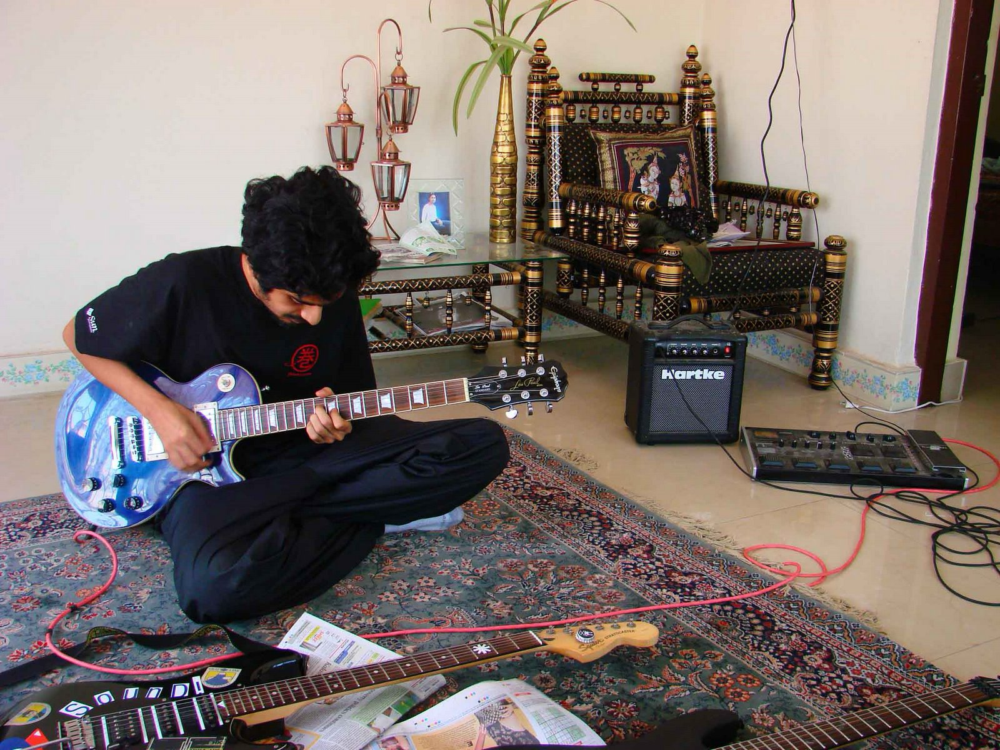

i’ve been buying guitars for like 25 years now. started out in india picking up cheap ones—fake gibsons, the kind folks now lovingly call “chipsons.” over the years, i’ve probably owned a dozen or so. rn i’m down to four: a beat-up nylon string, a gorgeous les paul prophecy in red that i gifted myself when i quit smoking, a sarah longfield signature six-string that’s just _mwah_, and my og blue epiphone les paul from 2007—first “real” guitar i ever bought, with contractor per diems on my first trip to the us.

anyway, a while back i took that blue les paul in to get a setup—fix the string height, tweak the neck, just the usual stuff. i didn’t know much at the time, was just vibing and playing what i liked. i remember chatting with the tech and he said something that stuck: guitars aren’t designed to be pristine sculptures. they’re made to be _worked on_. glued together from multiple pieces, truss rod down the neck, frets you can swap, pickups you can change out, wiring you can mess with. it’s _meant_ to be adjustable. if it was all carved from a single block of wood? sure, might look “perfect,” but it’d warp with the weather. and good luck fixing anything when it does.

and that’s the thing—my favorite guitars aren’t the expensive ones. it’s still that beat-up blue les paul and the junky nylon string i grab most often. not bc they’re better. bc they’re _easier_. they’ve been dropped, modded, scratched, loved. i’m not scared to play them. they just _work_.

and this, weirdly enough, brings me to javascript.

for the past 20 years, people have said the same thing: “javascript is a bad language.” quirky. full of gotchas. weird coercions, strange syntax, auto semicolon insertion, whatever. and yeah, it _was_ hacked together in 10 days by brendan eich. named “javascript” as a marketing stunt bc of java applets. but the core of the language? it’s lisp. or at least, _inspired_ by lisp. functions as first-class citizens. loose typing. metaprogramming. minimal rules. extreme flexibility.

tons of “better” languages have come at the throne since—safer, stricter, faster. and they’ve all lost. not because js is pre-installed on browsers (though sure, that helps). but bc js _bends_. it adapts. it absorbs. it evolves.

look at how async/await got added. look at how modules evolved. look at types as _comments_—soft types that don’t break your code if they don’t line up. that’s how typescript won, btw. not by being perfect. by being _soft_.

the best tools aren’t the purest. they’re the most forgiving. they survive bc they let people _tinker_. same with guitar. you can suck and still make music. you don’t need to be a shred god. learn four chords, strum a bit, and suddenly you’re playing songs your friends know. you’re _in it_. expressive power with a low floor and a high ceiling.

so yeah. guitars are like javascript. a little janky. a little noisy. built to be played, not polished. but if you stick with it—if you _play_—they can do anything.
