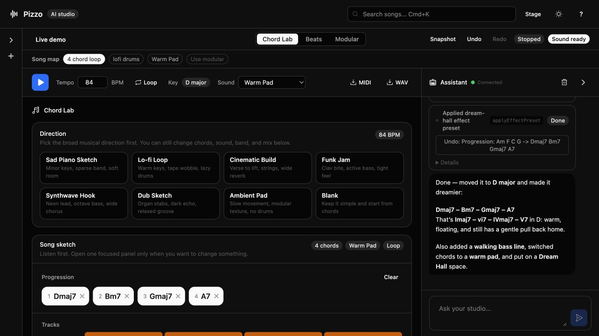

_(this is the blog version of a talk I gave at Local-First Conf. I'll update this post with a link to the video when it's released.)_

I have a little music app called [Pizzo](https://github.com/threepointone/pizzo), which I demoed during the talk.

it has the things you'd expect from a music app: a chord progression, tempo controls, drums, bass, a synth, buttons and sliders and pads you can click. you can press play, grab a control, and change the song. extremely computer stuff.



it also has an agent. you can tell it “make this dreamier in D” and the chords change. ask for a walking bass line and it adds one. ask it to take the whole thing up a step and it transposes the song.

the agent doesn't generate a new music app or give you some code to download. it reaches for the same song you already have open and changes it. then you can reach back in with your hands and change it again.

one document, two hands.

I've been using this as a way to think about agents outside coding. the agent isn't the app, and the chat isn't the thing you're working on. the agent is a guest in the app, editing the same document you are.

## why coding agents got here first

coding agents feel much more general-purpose than most other AI products. you can drop one into a repository and ask it to fix a bug, add a feature, inspect some logs, run tests, or explain why the build is doing something cursed. none of those actions had to be individually designed into a chat UI.

the model matters, obviously, but the model isn't working alone. coding agents usually have:

- a workspace: somewhere to make things and find them again later
- a place to run things and see what happened
- tools that can read, write, fetch, call, and act
- a computer, with access to the user's data and capabilities

this lets them make a change, run the code, inspect the result, and try again. code is unusually convenient here because it is runnable text; the feedback loop comes with the medium.

developers are navel-gazers. we love making tools for ourselves, so coding agents got to inherit repositories, shells, editors, test suites, package managers, debuggers, and decades of work making all of them scriptable. we didn't just give the model code. we gave it the whole workshop.

outside programming, the story is much thinner. most products put a chat box in front of an existing application, or ask the model to generate an answer from scratch. few give an agent the equivalent of a coding harness around an ordinary person's actual work: a song, spreadsheet, drawing, itinerary, or document, with tools for inspecting it, operations for changing it, and a way to see what happened.

maybe this isn't a limitation of the models. maybe we built agents a proper workshop where developers work, then handed everyone else a text box.

but the output doesn't have to be code. the same setup can operate on a song, spreadsheet, canvas, map, video timeline, CAD model, etc. it needs a representation it can inspect, useful operations it can call, and some way to observe the result.

## don't put the chat in front of the app

the obvious way to add an agent to software is to put a chat box in front of it:

> you → chat box → agent → application → your thing

the song or spreadsheet or document still exists, but now the agent is standing in the doorway. to touch the thing, you first explain yourself to an input box.

I don't want the agent in front of the application. I don't particularly want it hidden behind the application either, quietly rearranging things on my behalf. I want it beside me:

> you + your agent → application → your thing

in Pizzo, both of us can reach into the application's goo and mold it. the agent uses intent and tools. I use my fingers, pointer, keyboard, or MIDI controller. adding the agent gives me another way to shape the song without removing the controls I already had.

this is why I'm skeptical that chat is the successor to the GUI. I wrote more broadly about this in [after WIMP](/posts/after-wimp/), but the short version is that direct manipulation is good. a spreadsheet cell, canvas shape, piano roll, or slider has a spatial obviousness that language doesn't.

chat is useful when I know the outcome but not the exact moves. direct manipulation is useful when I know the move. in Pizzo I can drag the tempo slider because my hand is already there, then ask the agent to make the progression “more wistful” because that is easier to say than choosing four replacement chords.

there's no reason those inputs should live in different applications.

## keep the work in the document

a lot of current AI software accidentally makes the conversation the source of truth. you ask for a thing, the model emits a result, you ask for a revision, and it emits the whole thing again. after a while the state is smeared across a transcript and has to be reconstructed whenever anything wants to use it.

Pizzo keeps the song as ordinary application state. the UI reads it, the audio engine plays it, direct controls modify it, and agent tools modify it. chat is one input surface over the song, not the container holding the song.

that also makes it possible to have several surfaces over the same work: a desktop editor, phone, MIDI controller, voice interface, whatever. they don't need to agree on a UI. they only need to agree on the document and its operations.

the chat should not own the song. the song should own the song.

## let boring code do the precise bits

the model in Pizzo isn't secretly doing music theory by vibes. when I ask it to transpose the song, a deterministic function does the transposition. when I ask for richer chords, a music theory library does that transformation. the model mostly turns fuzzy intent into an operation and its arguments.

roughly:

```ts
const operations = {
  setProgression(chords: Chord[]) {
    song.update((draft) => {
      draft.chords = chords;
    });
  },

  transpose(semitones: number) {
    song.update((draft) => {
      draft.chords = transposeChords(draft.chords, semitones);
      draft.bass = transposeNotes(draft.bass, semitones);
    });
  },

  addBassline(style: BassStyle) {
    song.update((draft) => {
      draft.bass = generateBassline(draft.chords, style);
    });
  },
};
```

the button calls `transpose(2)`. the agent can call `transpose(2)`. there isn't a normal implementation and an AI implementation.

this keeps the important part of the application boring and testable. arguments can be validated, permissions enforced, changes recorded and undone. the model decides which control to reach for; ordinary software applies the change.

## what gets synced

if the document is shared by the user and the agent, they need to see each other's changes. reconnecting should load the current song, not replay a conversation in an attempt to reconstruct it.

the version of Pizzo I showed at Local-First Conf associates each song with a Durable Object. the browser renders and manipulates the song, while the Durable Object gives it a durable, addressable home and somewhere for the agent to join. direct controls and agent tools use the same operations, and changes are sent to the other connected surfaces.

putting state in a nearby Durable Object does not automatically make an application local-first in the strict sense. if every edit needs a server round-trip, it is still a server-backed app, however fast the server is. a stronger implementation would keep a durable local replica, accept offline edits, and reconcile them later.

what I want to preserve is the useful part of the local-first contract: the document belongs to the user, direct edits feel immediate, the application remains useful without the agent, and sync helps the document move between surfaces. the agent joins that arrangement as another client. it doesn't become the owner just because it runs somewhere else.

## why Think is serverless

the infrastructure math changes once this is for everyone, not just developers.

depending on how you count, there are perhaps 40 or 50 million software developers. coding agents give some fraction of them a workspace, tools, a sandbox, and compute. once the same idea applies to ordinary software, the possible audience becomes hundreds of millions or a billion people. those people may have several agents or documents each.

giving each one a permanently running server or container would be wasteful. agents also don't fit neatly into an interactive web session. an agent may be waiting for an event, waking up on a schedule, continuing a job, or doing something while its user is away. closing the browser shouldn't destroy it, but “still exists” shouldn't have to mean “keeps a container running all night.”

this is why I'm building [Project Think](https://developers.cloudflare.com/agents/harnesses/think/) as a serverless harness. it provides the workspace, tools, sandboxed execution, state, and feedback loop without asking developers to maintain an always-on server for every agent.

the agent stays addressable, but it doesn't have to keep burning CPU. it can retain an identity and state, sleep when nothing is happening, then wake up for a message or an alarm. Workers supply compute when it has work to do; a Durable Object supplies the addressable stateful part that survives between invocations.

to the application, it still looks like a small computer belonging to a person or document. but there isn't a container sitting idle because that person went to lunch.

I'm not pretending those numbers are a forecast. the point is that moving from “developers get harnesses” to “users get harnesses” changes the unit of infrastructure. the serverless part is what makes that unit affordable to hand out freely.

## the harness is the app

“agent harness” usually means the machinery around a model: workspace, tools, memory, sandbox, permissions, and the execution loop. coding harnesses look like developer environments because their document is a codebase.

Pizzo wraps that machinery around a song. a spreadsheet could wrap it around cells and formulas; a canvas around shapes and layers. the UI remains a normal application, but the app's state and operations can be read and changed by the agent as well as its human user.

that's really all I mean by “the harness is the app.” not that every interface should become a chat window, or that the model should generate the application again on every turn. the application already has the document, controls, deterministic logic, history, persistence, and sync. those are exactly the things an agent needs around it.

let it use them, beside the user.
