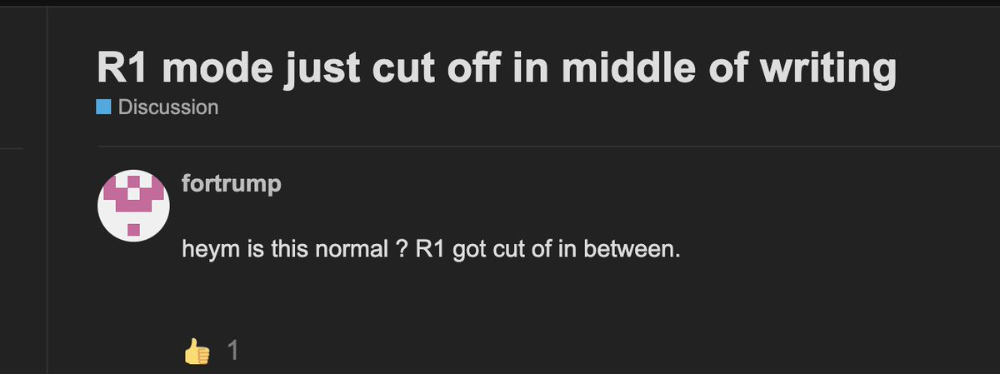
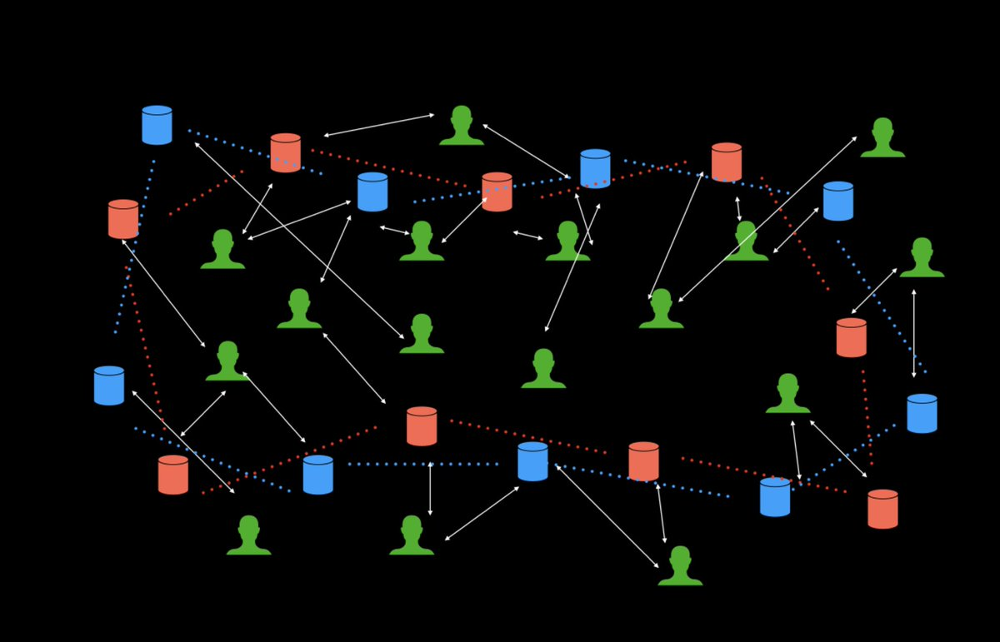
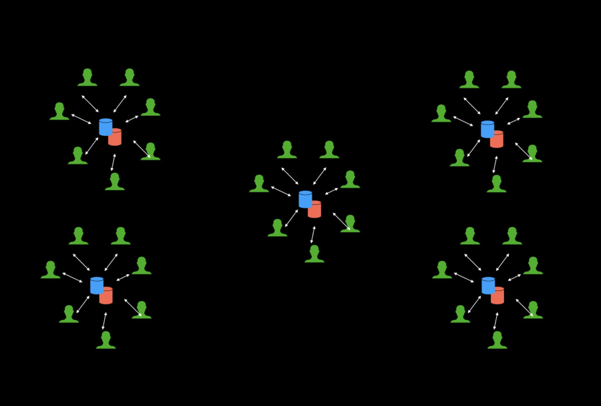

tl;dr - one durable object per chat room, websocket connection to it, and you're done. no more disconnects or weird architectures.

Folks typically build ai chat systems with serverless offerings from providers (like aws lambda and cloudflare workers). They're architected as normal request-response systems, with a backing database somewhere. While they "work", they're not ideal for a number of reasons:

- because they try to stick to a request-response model; it means subsequent messages are blocked until the previous one is finished. This is particularly annoying when the streaming response is long, and you have a bunch of messages you want to send anyway.

- maybe you then try to implement a queuing system in yet another service, making your architecture even more complex, and you have to twist and turn your code to make it work.

- all these serverless things use some form of streaming responses, directly proxied to the LLM provider; this means if you're in the middle of a long response, and you get disconnected/refresh your browser, you lose your place. this is particularly bad with the rise of reasoning models like openai's o1, deepseek's r1, all those. with timeouts and all, the stream breaks eventually even if you're not disconnected.

- ok so you decide to use your database as the source of truth, somehow piping the responses to it, and then having your frontend read from the db. maybe your db has a subscription type thing. suddenly you're having to manage race conditions as well. what you thought would be a weekend optimisation is now a full time job.

- ever think about why multiplayer ai chat systems are so rare? this is why. not even discounting that websockets for true real time chat aren't really possible with these serverless offerings. you have to deal with message ordering, a reliable broadcast system, all that. (I've spoken about length about how this is now going to be thousands in sunk cost)

honestly I could go on and on. but "serverless" is just a bad fit for realtime/long running/multiplayer systems in general. it's honestly amazing how far people have come with it at all. just stop faffing around trying to fit a chat sized square peg into a serverless round hole. you can fix all of this today.

durable objects (bad name, amazing tech) solve all of this. literally. durable objects are like tiny javascript vms/containers/computers that you can spin up for an entity, and keep them around for a long time. in this scenario, you'd spin up a durable object for every chat room, and let users (and ai!) connect to it. use websockets to connect to them, and stream messages back and forth. that's it.

message ordering is guaranteed because it's just a websocket. you can either hold the entire state of the chat room in memory, and/or use the inbuild database (one per durable object) to store all your messages and stuff. because it's just syncing state over a websocket, it doesn't matter whether you reconect/disconnect/refresh your browser. you just get all the state again on reconnection and resume streaming. the actual ai stream will keep piping into your persistence whether or not you're connected. want to do multiplayer? connect with another websocket, done. no race conditions, your state and compute are running on a single thread in the durable object. want to do server side rendering? first use an http request to render the html from inside the durable object, and then continue streaming when a websocket connects. done. these objects will go to sleep when non one's connected. and spin back up with zero cold start time when you come back.

stop faffing. use this tech, ship your thing.

- an entire chat backend build with durable objects/websockets/persistence in 150 loc: https://github.com/threepointone/durable-chat/blob/main/src/server/index.ts
- durable objects are computers https://sunilpai.dev/posts/durable-objects-are-computers/
- the cloudflare stack for ai apps https://sunilpai.dev/posts/cloudflare-workers-for-ai-agents/

ship today. sleep tomorrow.
