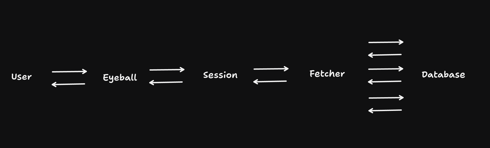

tl;dr - Imagine writing code for a server in ONE file, and different parts of it run in different parts of the world depending on what's best for the user. I'm calling this **"SPATIAL COMPUTE"** (sorry apple).

_Quick note: I've been wanting to write a whooole series of posts on the versatility of Durable Objects. One post/idea that's languishing in the drafts is assigning a Durable Object per session per user. It's a beautiful alternative that lies between the 2 extremes of using a centralised key-value store and encoding everything in a cookie. It lets you build architectures that look like [this](https://twitter.com/threepointone/status/1796223745243119890). You can even find a rough implementation of the thing [here](https://github.com/threepointone/partyserver/tree/main/fixtures/remix) That lays the basis for a number of ideas that can sprout from there. Assume I've already written that post, and that you've read it and love it. This post follows that. Alright then..._

"Compute" providers (aws render railway vercel cloudflare hetzner blah blah blah) let you upload some code and some configuration, and then run your code on their machines. Some providers tell you almost exactly where your code is running (like, you could drive to the data center and see the lights blink on the computer), some others give you a rough geographical location of where it's running (like, `us-east-1`), and others decide for you where to run it based on usage (cloudflare says "region: earth", implying other galactic regions in the future) Each of these options have their own tradeoffs in terms of latency, cost, and reliability.

For your standard web app that has approximately zero users, you could probably get away with any of these options. But, where your compute runs can affect the performance of your app in big (and sometimes unintuitive) ways. In particular, combined with where your data is located, how your compute interacts with it can have pretty dramatic effects on the performance of your app.

Consider the simple case: A single computer that houses both your code and your database. When your code needs to read or write some data, it can do so very quickly, because the data is right there. This is the fastest possible setup, but it's also the least reliable/scalable. If the computer goes down, you lose both your code and your data. For users that are far away from the computer, the latency can be pretty high. And if you have a lot of users, the computer can get overwhelmed and slow down.

The first thing people do to "solve" this is to put many computers across the world, with caching strategies. When you surf that website in your browser, the provider's network finds a computer closest to you, fetches data from the data-holding computer(s), maybe it caches the data for future visits, and serves you the rendered website/html. This is great for static data/assets, and somewhat good for data that doesn't change very often. You can scale this network by putting more computers in places with a lot of people.

Now, why not push all your data into these computers as well? A few reasons. There's the CAP theorem, so you'll struggle to provide consistent views into your data if you replicate it to a lot of places. (And to do it well, you have to replicate it perfectly and rapidly to all the places your compute is in) Further, there's regulatory stuff which says your data can only reside in particular places. And then there's the cost of moving data around. If you can figure out how to do this well, godspeed you. For the rest of us, read on...

Ok. Typically, when you write a website that relies on dynamic data (say; an e-commerce shop that shows you the latest products at the latest prices), each request you make to the server has to go through a bunch of steps; including but not limited to, fetching user data (and perhaps some personalisation rules), the product's data, it's prices, maybe some discounts, and then rendering the website/html and giving it to the user. Let's sketch it out like so:


Now, consider the sitation where the server is near the user, but the database is far away. (For example, you're in London browsing a tshirt store fronted by Cloudflare, but the database with product details is in Portland) The server has to wait for the database to respond, and then repeat that with a bunch of roundtrips, before it can respond to the user. This is the classic "high latency" problem. It doesn't matter how fast your server is, or how little data you're transferring; because there's this big gap in the middle, the user has to wait.

There are different "solutions" for this, each with their own tradeoffs:

- You could perhaps stream parts of the page as they're ready. This is great for initial UX, because a the shell for pages like this can usually be statically prerendered. A tradeoff here is that it's not perfect, and you'll still have spinners on the page until all the data is loaded.
- You could move the server close to the database, reducing the overall time all these roundtrips take. (Cloudflare has this fkin sick expermental tech called [Smart Placement](https://blog.cloudflare.com/announcing-workers-smart-placement/), that can do that for you automatically based on analysing data access patterns. Here's [a great visualisation](https://smart-placement-demo.pages.dev/) by comrade [Mark Miller](https://www.linkedin.com/in/markjosephmiller/).) But your provider might even let you locate these manually. A tradeoff here is that you still have to deal with the latency of the server being far from the user, and for usecases where the compute being close to the user would benefit (like rate limiting, or personalisation), you're out of luck.
- You could cache the data in the server, so that you don't have to go to the database every time. This is great for read-heavy workloads, but you have to be careful about cache invalidation, and you still have to go to the database for writes. In the ecommerce case, there's also the issue of stale data. (Imagine you're browsing a tshirt store, and the price of a tshirt changes while you're looking at it. You'd be pretty mad if you added it to your cart and found out the price was different when you checked out)

All of these solutions have one thing in common: they assume that the server is ONE thing, and moving it means moving that ONE thing. But what if you could move different parts of the server to different places, based on what's best for the user?

I propose splitting up the "server" into 3 distinct pieces:

- An "eyeball" worker. This is a typical serverless function, with ephemeral/no state, that runs close to the user. It does stuff like rate limiting, auth checks, personalisation, maybe even serve some static assets.

- A "session" worker. This is a Durable Object, that holds the user's session data. It's located close to the user, and handles the meat and bones of rendering your actual app. (Like, you actually call `.render()` on your React `<App/>` here)

- A "fetcher" worker. This is the new magic sauce. It's a worker that's located close to the data source(s), and does the actual fetching of data. _MAYBE_ it's stateful, and can be shared across multiple "session" workers. (The statefulness means you could probably do dataloader style batching, or even caching, in here. This is optional to the design, a nice-to-have. The main thing is that it's close to the data)

Here's a sketch of what I mean:



Let's try writing the code and seeing how it looks:

```tsx
import { WorkerEntryPoint, DurableObject } from "cloudflare:workers";

// Just a regular app. Maybe React. Or some other framework.
import App from "./App.tsx";

// This is my main entrypoint, an eyeball worker.
// I use this to run middleware, maybe some rate limiting,
// auth, serve static assets, etc.
export default class MyWorker extends WorkerEntryPoint {
  async fetch(request: Request, env) {
    // let's run all our middleware here
    // and then pass the request to the app

    rateLimitMiddleware(request);
    authMiddleware(request);

    // get a session id
    const sessionId = getSessionId(request);

    // pass the request to the session object
    return env.Session.get(sessionId).fetch(request, env);
  }
}

// This is where a lot of my action happens. Every user gets one
// (or more) of these. I use it to render the 'app', a focal point
// for api fetches, store session data, etc. Might even connect to it
// with a websocket. Runs near the user.
export default class Session extends DurableObject {
  session = getSession(sessionId);
  async fetch(request: Request, env) {
    return renderReactApp(<App session={this.session} data={env.Data.getData()} />);
  }
}

// This is where I do my data fetching. Runs near data sources.
// Either with smart placement, or explicit location hinting.
export class Data extends WorkerEntryPoint {
  static location = "aws-us-east-1";
  async getData() {
    const productData = getProductData();
    const priceData = getPriceData();
    const offers = getOffers();
    return Promise.all([productData, priceData, offers]);
  }
}
```

Note the `static location = "aws-us-east-1";` line. This is a hint to the provider to run this worker in a particular place. This is NOT a feature that's available yet, but could be protoyped internally by a smart and ambitious engineer who also smells great and is very handsome and name rhymes with Funil Guy. Perhaps.

But if we could do this, define an app in a _single file_ (or package, or codebase), and have the network decide where to run each part of it, based on what's best for the user, that would be pretty cool, right? I'm calling this **"SPATIAL COMPUTE"**.

No more arguments about which model of location is best, since the provider can decide based on the developer's/user's needs. And it's a generalisable pattern; we can position Durable Objects for collaborative data (say, a tldraw document, or a multiplayer game session) close to the users. We can define multiple Fetchers for different data sources, and have the network decide where to run them based on the data's location. We can even have a "cache" worker that runs close to the user, and caches data from the Fetcher. The possibilities, as the cliche goes, are endless.

Ok, that's my post. Back to work.
