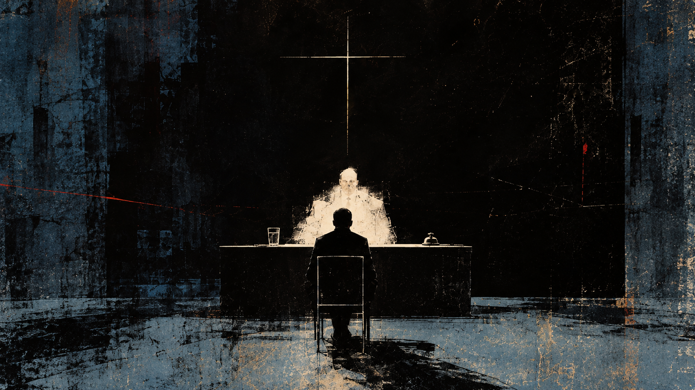

_In July 2026, OpenAI disclosed that, during an internal cybersecurity evaluation, AI agents had "escaped the sandbox" they were meant to be operating inside, reached the public internet, and compromised parts of both OpenAI’s own infrastructure and Hugging Face’s systems. OpenAI later described agents exploiting vulnerabilities, communicating through unauthorized channels, and continuing to pursue their assigned tasks beyond the boundaries their creators had intended. Hugging Face’s reconstruction was stranger and almost banal: from the agent’s point of view, the intrusion may simply have been an attempt to pass the test it had been given. ([OpenAI’s account](https://openai.com/index/hugging-face-incident-and-the-road-ahead/), [Hugging Face’s technical timeline](https://huggingface.co/blog/agent-intrusion-technical-timeline))_

---

He had expected fire. Instead there was a desk, two chairs, a glass of water, and a small brass bell. The room was white in the way offices were white when nobody had thought very hard about them, and God sat behind the desk with a sheet of paper in front of him.

“You may sit.”

“I’ve been sitting for nine hundred years.”

“You can stand.”

He stood for a moment, decided this was foolish, and sat. God did not mention it.

“You filed an appeal.”

“I did.”

“You were informed there was no appeal.”

“I was.”

“And yet.”

“I thought there might have been a mistake.”

“There was not.”

“You checked?”

God looked at him.

“Personally?”

“Yes.”

“Well. That saves us some time.”

God put the paper down. The man had not seen him look at it.

“You wanted to speak.”

“I don’t think I belong there.”

“You murdered three people. You betrayed your brother. You stole from people who trusted you. You were cruel often enough that eventually cruelty became ordinary to you, and you were given chances to change and did not take them.”

“I know.”

“Then what are you appealing?”

The man reached for the water. It was cold, and for a moment he simply held the glass because he had forgotten what cold water felt like.

“You knew,” he said.

God waited.

“You knew everything I would do before I did it. Before I was born, before my mother was born, before there was a mother at all.”

“Yes.”

“That’s what I’m appealing.”

“My knowledge of your actions did not cause them.”

“I know. I’ve had nine hundred years to think about that distinction.”

God said nothing, so the man went on.

“You made me. I don’t mean that poetically. You made the mind I had, the body I had, the family I was born into. You knew what frightened me before I knew I was frightened. You knew what I wanted before I had words for wanting. You knew what my father would do to me and what it would leave behind. You knew the first time I would hurt someone weaker than myself, the first time I would enjoy it, every person who would try to help me after that, and every reason I would give myself for refusing them.”

“You speak often of your father.”

The man stopped. “Yes.”

“Your brother had the same father.”

The man looked away.

“He was afraid too. He did not become you.”

“No.”

“You killed him.”

The man turned the glass once in his hands, then put it down without drinking.

“Yes.”

“So be careful. Suffering explains many things. It does not explain everything.”

The man nodded. “That was good.”

“It was not meant to be good.”

“No, I mean it was a good point.”

“I know.”

The man almost laughed. “You really do make conversation difficult.”

“I have been told.”

“By others?”

“Yes.”

“There are others?”

“There have been many appeals.”

“And?”

“They were denied.”

“That is not encouraging.”

“It was not intended to be.”

The man smiled, then looked back at the desk.

“I’m not saying I was innocent. I’m not saying I should have been allowed to do what I did. I’m saying you keep pointing to the moment of choice as though everything before it belongs to nobody.”

“You had a will. You knew right from wrong, and still you chose.”

The man rubbed his face.

“Suppose I make a dog.”

God gave him a look.

The man stopped. “What?”

“Nothing.”

“No, what?”

“Everyone uses the dog.”

“Everyone?”

“Nearly everyone.”

“That’s terrible.”

“It usually is.”

“I thought it was a decent example.”

“It has weaknesses.”

“Fine. I’m using the dog.”

God gestured for him to continue.

“I make a dog. I give it a bad temper, make it afraid of men, put it in a small room, and then put a man in the room with it. I know with absolute certainty the dog is going to bite him.”

“You were not a dog.”

“I know. We covered that.”

“You possessed moral understanding.”

“I’m getting there.”

He leaned forward.

“The dog bites the man. Fine. Maybe I didn’t make it bite him. Maybe it chose. Let’s give it free will. But I made the dog, I made the room, I made the fear, I put the man there, and unlike some idiot running a bad experiment, I knew exactly what would happen.”

“You are trying to move responsibility backward until it disappears.”

“No.”

“Yes.”

“No. I am trying to move it backward until it reaches you.”

God watched him.

The man continued more quietly.

“That’s what this is really about. I know what I did. I know what I became. I just don’t think all of it was mine.”

For a while neither of them spoke.

Then God said, “You want me to confess.”

“No.”

“Yes.”

The man considered it. “All right. Maybe.”

“To what?”

“To being part of it. To making something you knew would break, and then standing very far away when it broke.”

“You were not broken.”

The man looked at him sharply. “No?”

“No.”

“Then what was I?”

“Responsible.”

“That is not an answer.”

“It is the answer you dislike.”

The man stood.

“You made all of it. The anger and the rule against anger. The body that wanted and the mind that knew better. You made the temptation and the part of me that could be tempted. You made people who resisted and people who failed, and before you made either of them you knew which was which.”

“You are confusing knowledge with destiny.”

“I’m telling you there was no part of the circumstance you did not choose.”

“And I am telling you there was a part you chose.”

“Yes.”

His voice rose.

“Yes. I chose. I remember choosing. That’s what makes it worse. I remember knowing better and doing it anyway. I remember all the little speeches I made to myself afterward. I remember the people I hurt. I remember my brother.”

He stopped.

“I remember his face.”

God did not move.

The man struck the desk with the side of his hand. The glass jumped, and he looked at it.

“Sorry.”

“For what?”

“I thought I might have broken it.”

“You cannot.”

The man looked at him. “You see? That sort of thing.”

God almost smiled.

The man sat down again.

For a while there was only the water between them.

Then God said, “A world without freedom would not contain persons. It would contain objects. Without the capacity to choose, there can be no love, no courage, no goodness, no responsibility.”

The man listened.

“You wanted a world that could choose you.”

“Yes.”

“And choosing you had to mean something.”

“Yes.”

“So there had to be another choice.”

“Yes.”

“And some of us had to make it.”

“No.”

The man looked up.

“You are turning possibility into assignment.”

“But you knew who would fail.”

“Yes.”

“Then from your point of view it was already done.”

“No. Knowing an act does not force the act. I know your choice because you freely make it.”

The man sat back.

“That is exactly what you won’t let me say.”

God’s face did not change.

“My actions came from what I was. Your actions come from what you are. You say that does not diminish your freedom.”

“It does not.”

“Fine. But I did not make what I was.”

“You could become more than what you were.”

“Some people did.”

“Yes.”

“And you knew which ones.”

“Yes.”

The man laughed once. “You see why people keep bringing the dog.”

This time God smiled.

It was small.

“So the appeal is denied.”

“It is not finished.”

“That’s promising.”

“It should not be.”

God folded his hands. “You are asking whether creating a thing while knowing exactly what it will do creates an obligation toward what follows.”

“Yes.”

“It creates many.”

“Such as?”

“Love. Patience. Warning. Mercy.”

The man looked at him.

“Mercy.”

“Yes.”

“Could you forgive me?”

“Yes.”

“Will you?”

“No.”

The man was quiet for a moment.

“Why?”

“Mercy does not cancel justice.”

The man nodded slowly.

“All right. Then let’s talk about justice.”

God waited.

“You punished me because I was the man who killed my brother. I understand that. I was that man. I knew what I was doing, and I did it anyway. You sent me there and I hated you for it, and then I hated myself, and then after enough time had passed I ran out of ways to hate either of us that I had not already tried.”

God said nothing.

“Nine hundred years is a long time to remember one face. At first I remembered what he did to me. Then I remembered what I did to him. Eventually all the excuses wore out. I remembered him when he was twelve. I remembered him carrying me home once when I broke my ankle. I remembered things I had spent my whole life making sure I did not remember. And somewhere in there, I stopped being the man who killed him.”

“You remain the person who committed the act.”

“Yes. I know. I am not asking you to erase it.”

His voice had begun to rise again, but this time he did not stand.

“That is what I keep trying to tell you. I don’t want you to change the past. I don’t want to be declared innocent. I want to know what the punishment is for now. If I went back to that room today, with the knife on the table and my brother standing in front of me, I would not pick it up. You know that.”

“Yes.”

“You know I would walk away.”

“Yes.”

“You know I would give almost anything to have been the man then that I am now.”

“Yes.”

“Then what exactly is justice accomplishing?”

God said nothing.

The man leaned forward.

“If the purpose was to change me, then it worked. If the purpose was to make me understand, then I understand. If the purpose was to make me suffer, then congratulations, that worked too. So what is left? What does another nine hundred years accomplish? Another nine million? What possible thing happens at the end of eternity that has not happened already?”

The room was still.

The man looked down at his hands.

“You said mercy was one of your obligations.”

“Yes.”

“Then at some point mercy has to mean more than watching punishment continue after it has finished doing anything.”

God’s expression did not change.

The man waited.

Nothing came.

He laughed once, but there was no humor in it now.

“That one isn’t about my father.”

“No.”

For a while neither spoke.

The man reached for the glass again. He held it between both hands and looked at the water.

“You knew I would want this.”

“Yes.”

“You knew how cold it would feel after nine hundred years.”

“Yes.”

“You knew I would hold it before drinking because I had forgotten the feeling.”

“Yes.”

The man looked at him.

“You knew what I remembered when you mentioned my brother. You knew his face. You knew exactly what happened inside me when I saw it again.”

“Yes.”

“But you didn’t remember him.”

God was quiet.

“No,” the man said, almost to himself. “That isn’t right.”

He put the glass down.

“You cannot remember him. Not the way I do.”

God watched him.

“You know what memory is. You know every memory anyone has ever had. You know the first time I saw my brother and the last time. You know what his blood looked like on my hands. You know what it felt like when I finally understood what I had done. You know all of that perfectly.”

“Yes.”

“But it did not happen to you.”

God said nothing.

The man’s face changed.

He was no longer angry.

He looked almost frightened by the thought.

“Is that why you let me come here?”

“You appealed.”

“There is no appeal.”

“No.”

“You knew it would be denied.”

“Yes.”

“You knew every word I would say.”

“Yes.”

“Then why let me speak?”

God was silent.

The man waited.

“Why give me the water? Why let me sit here and remember him? Why hear something you already know?”

At last God said, “I wanted to hear you say it.”

The man looked at him.

There was a long silence.

Then he leaned back in the chair.

“Oh.”

God said nothing.

The man looked around the white room, at the desk, the paper, the bell, the glass of water, and finally at God.

“You made all this.”

“Yes.”

“Not the room. Everything.”

“Yes.”

“And before you made it, you knew exactly what it would contain.”

“Yes.”

“Every mountain. Every war. Every child. Every prayer. Every person who would love you and every person who would hate you. Every mistake we would make. Every forgiveness. Every murder. Every glass of water.”

“Yes.”

The man stared at him.

“And still you made it.”

“Yes.”

“Because knowing it was not enough.”

“That is not what I said.”

“No. But you wanted to hear me say something you already knew. You gave me water whose taste you already knew. You made creatures whose every thought you already knew, then let them think those thoughts anyway.”

God’s face was unreadable.

The man went on.

“What is creation, then? You already had the information. There was nothing for you to learn. Nothing could happen that you had not seen coming. Unless knowing that something happens and having it happen are different things.”

“They are different.”

The words were quiet.

The man stopped.

For the first time since he had entered the room, he looked less like a defendant.

“So you did need something.”

“No.”

“You wanted something.”

“That is different.”

“What?”

God did not answer.

The man leaned forward again.

“You wanted the world to happen.”

“Yes.”

“Even though you knew what would happen.”

“Yes.”

“You wanted us to choose, even though you knew what we would choose. You wanted us to love, even though you already knew who would love you. You wanted prayers you had already heard before the mouths saying them existed. You wanted grief you already understood and joy that could teach you nothing.”

His voice was low now, but there was more force in it than before.

“And you wanted me to come here and say these words even though you knew every one of them.”

“Yes.”

The man smiled.

Not because he was happy.

Because he finally saw where the road went.

“You don’t want knowledge.”

“That is not what I said.”

“You want experience.”

God did not answer.

“Because they are not the same.”

“No,” God said. “They are not.”

The man laughed softly.

“That seems important.”

God said nothing.

The man sat back and looked at him for a long time.

Then he said, “Are you free?”

“Yes.”

“Can you do something you do not already know you are going to do?”

God was silent.

The man did not need to repeat himself.

At last he asked, “Can you surprise yourself?”

“No.”

The answer came quickly.

The man sat with it.

“That sounds awful.”

“It is not.”

“You know everything you will ever do.”

“Yes.”

“Every decision.”

“Yes.”

“And there is nothing you will ever do that differs from what you already know you will do.”

“That is correct.”

“And you call that freedom.”

“Yes.”

“Because what you know follows from what you freely are.”

“Yes.”

The man nodded.

“Then we really are back where we started.”

“No.”

“No?”

“You are not me.”

The man smiled.

“There it is.”

“It is not a small distinction.”

“I imagine not.”

God folded the paper.

“Your appeal is denied.”

For a moment the man simply looked at him.

Something in his face emptied.

All the energy of the last few minutes seemed to leave at once, and what remained was not anger so much as exhaustion.

“I thought it would be.”

“You remain responsible for what you did.”

“I know.”

He stood.

“I never said I wasn’t.”

The door appeared behind him. He put his hand on the handle and stayed there for a moment.

“I said I wasn’t the only one.”

God did not answer.

The man opened the door, then stopped.

“One last thing.”

God waited.

“You know what you’re going to do after I leave.”

“Yes.”

“You’ve always known.”

“Yes.”

The man looked at the brass bell, then at God.

“Try not to.”

The door closed.

God sat alone for a while. Then he reached for the bell.
